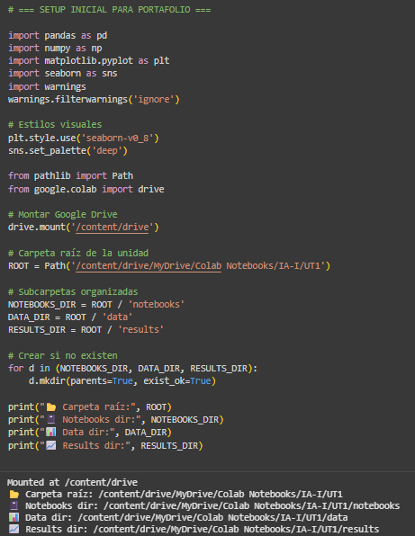
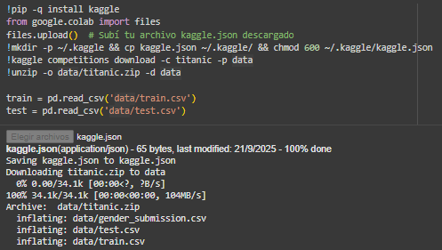
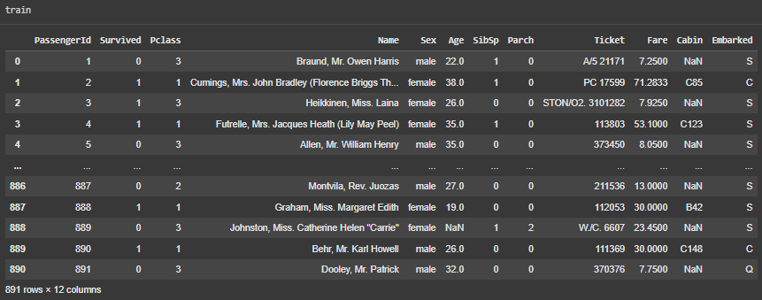
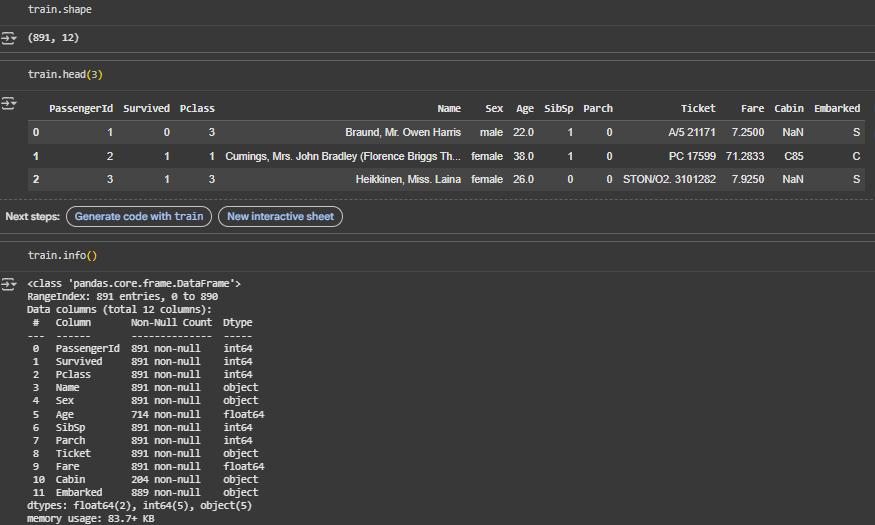
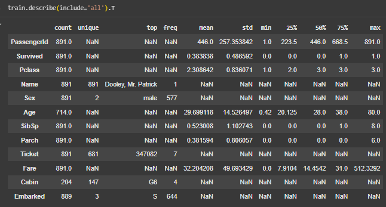
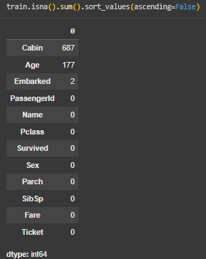
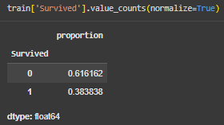
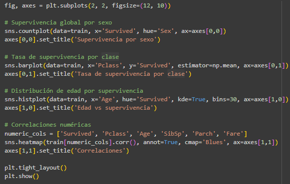
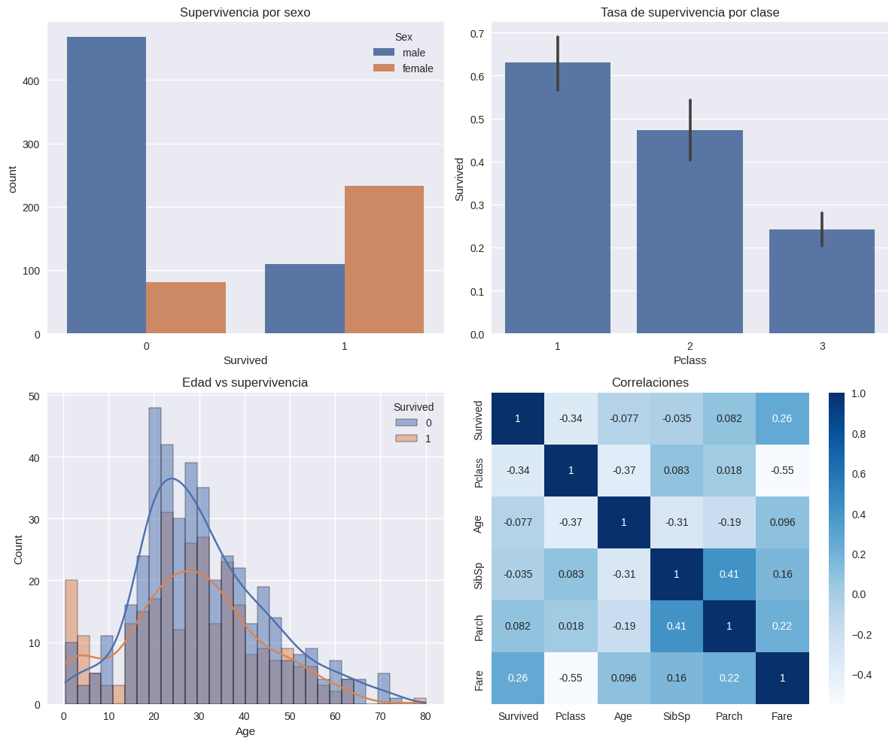

# Exploración del dataset Titanic: patrones de supervivencia y primeras hipótesis

---

## 📝 Contexto

> **Nota:**  
    En esta ocasión como primer acercamiento al trabajo con ML, rama de la IA vamos a trabajar con el dataset del [Titanic](https://www.kaggle.com/competitions/titanic/data), de esta forma a través de la práctica comenzamos a ponernos manos a la obra para explorar este mundo en auge dentro de la informática.

---

## 🎯 Objetivos

Explorar, preparar y utilizar herramientas clave para el aprendizaje durante el curso:

- [Google Colab](https://colab.google/)
- [Kaggle](https://www.kaggle.com/)
- [Pandas](https://pandas.pydata.org/docs/)
- [Numpy](https://numpy.org/doc/stable/)
- [Matplotlib](https://matplotlib.org/stable/users/index)
- [Seaborn](https://seaborn.pydata.org/tutorial.html)

---

## ⏱️ Actividades y Tiempos Estimados

| Actividad                      | Tiempo      |
|--------------------------------|:----------:|
| **Tarea 1:** Setup en Colab    | 5 min      |
| **Tarea 2:** Cargar dataset    | 5-10 min   |
| **Tarea 3:** Conocer dataset   | 10 min     |
| **Tarea 4:** EDA visual        | 15 min     |
| **Tarea 5:** Preguntas finales | —          |

---

## 🚀 Desarrollo

### Tarea 1 ✅ - Setup en Colab

Si bien el práctico es muy claro y se comparte el código correspondiente para poder realizarlo de manera muy rápida, como mencioné en los objetivos mi idea es empaparme de los temas y aprender realmente por lo cual dentro de esta tarea antes de preparar el setup comencé por leer la [Documentación](https://colab.research.google.com/#scrollTo=vwnNlNIEwoZ8) para entender qué era esto de Google Colab, a grandes rasgos es un Notebook, "un libro" digital con código dentro, la primera pregunta que me surgió es: ¿por qué lo escribimos y ejecutamos en esta plataforma en vez de en local en mi editor de texto? , la respuesta es sencilla, esos Notebooks primero que nada se almacenan directamente en mi Google Drive, haciendo esto fácilmente compartible con compañeros y es como un Plug and Play, de muy fácil uso, pero el verdadero potencial de esto radica en que al ejecutar lo que estoy desarrollando corre en Google Cloud aprovechando las GPU'S y TPU'S de ellos, gracias a esto, aprovechando la potencia del hardware de Google puedo probar todo mucho más rápido que utilizando mi máquina.

---

### Tarea 2 ✅ - Cargar el dataset de Kaggle

Dataset, no es otra cosa que el conjunto de datos con el cual vamos a trabajar, en este caso, los mismos fueron extraídos del evento del Titanic, con estos, probaremos las posibilidades, una introducción práctica a la parte del análisis de datos, ya que esto es la base de todo lo referido a ML'S e IA'S.

Volviendo a la tarea en particular, seguir el código es lo fácil, en lo que me detuve fue en investigar qué es Kaggle, básicamente explotamos el entorno de Google, ya que Kaggle es una plataforma y una comunidad donde aprender, practicar y completar problemas orientados al Data Science, ya que para entrenar modelos, predecir y más la base son los datos que existen a partir de los cuales analizar, buscar patrones y refinar un modelo que prediga el futuro posible. De esta plataforma tomamos los datasets públicos y disponibles para poder investigar y desarrollar nuestros modelos.

---

### Tarea 3 ✅ - Conocer el dataset

En este caso no había mucho que analizar desde cero, ya que dentro del desafio de kaggle te comparten de manera muy detallada cuales son los datos compone el [dataset](https://www.kaggle.com/competitions/titanic/data), qué columnas o atributos, qué nombre identifica cada uno, lo que representa, los valaros puede tomar, etc.

Lo interesante de esta parte fue el probar el código, las funciones disponibles, que acá me frene posterior a ver las salidas, para aprender qué se está utilizando, la librería de python [Panda](https://pandas.pydata.org/docs/).

Pandas es una librería open source, con una gran performance utilizada para todo lo referido a la estructura y el análisis de los datos, esta librería nos ayuda a explorar, limpiar y procesar los datos.

La información que tenemos que manipular (excel, csv, sql, etc) es cargada en una tabla de datos a la cual se la llama como "DataFrame" dándonos la posibilidad también de exportar los resultados devuelta a un archivo.

Pandas nos da todas las funcionlidades que necesitamos para esta área de la informática, filtrar, seleccionar, extraer y más operaciones con los datos. En conjunto con [Matplotlib](https://matplotlib.org/) otra librería la cual se encarga de todo lo que es la creación de visualizaciones estáticas, animadas de los datos que procesamos es el combo perfecto para el análisis de los datos.

Como siguiente paso utilcé la CheatSheet de pandas para un paneo general y la [APIReferences](https://pandas.pydata.org/docs/reference/frame.html) para investigar qué hace cada linea que utilicé:

```python
train.shape  # Tupla con filas y columnas
```
Devuelve una tupla con el número de las filas y de columnas que tenemos.

```python
train.columns  # Nombres de columnas
```
Devuelve los atributos que tenemos en el DF, lo que quiere decir los nombres de cada columna que tenemos.

```python
train.head(3)  # Primeras 3 filas
```
Devuelve las primeras 3 rows del DF.

```python
train.info()  # Resumen del dataset
```
Nos da un resumen del dataset (este puede ser modificado en función de que parámetros le pase).

```python
train.describe(include='all').T  # Estadísticas descriptivas
```
Nos devuelve una descripción estadística (percentiles, mediana, media, desviación estandar, etc) del DF, al enviar como parámetro el include "all" este análisis incluye todos los valores de las columnas.

```python
train.isna().sum().sort_values(ascending=False)  # Valores nulos ordenados
```
.isna nos da un output con todos los valores boolean donde, todos los valores NA serán True por el contrario serán False.

.sum suma la cantidad de elementos que tenemos.

.sort_values(ascending=False): Ordena el output de manera descendiente.

```python
train['Survived'].value_counts(normalize=True)  # Proporción de supervivientes
```
En este caso trabajamos con la columna "Survived" y obtenemos un output de la cantidad de supervivientes en formato de proporción por el atributo "normalize=True", básicamente del total que porcentaje sobrevivió y cuál no.

### Tarea 4 ✅ - EDA visual con Seaborn/Matplotlib

En esta tarea nos adentramos más en la parte visual, que también es muy importante para ayudarnos a entender y comunicar sobre resultados de los análisis.

La primera pregunta que me surgió fue ¿Qué es EDA? Análisis exploratorio de datos, es un proceso de investigación en ciencia de datos que utiliza estadísticas y visualizaciones para explorar conjunto de datos, descubrir patrones e indentificar problemas y generar nuevas preguntas.

En resumen, la idea es entender la estructura de los datos y preparar los mismos para todo tipo de análisis y trabajo con estos datos.

En el caso de esta práctica, este EDA lo realizamos visual con la librería [Seaborn](https://seaborn.pydata.org/tutorial.html), esta funciona sobre Matplotlib que ya mencioné anteriormente e integrando pandas para el trabajo con los datos.

---

### Preguntas finales, conclusiones.

**¿Qué variables parecen más relacionadas con `Survived`?**

Las variables más relacionadas con qué persona sobrevive, según el análisis serían primero que nada la edad, donde a través de la gráfica de estas, podemos observar como se siguió la regla de “niños y ancianos” primero, dado que son en estos dos polos donde se ve un mayor numero de supervivientes en función de las cantidades totales de los mismos.

Así mismo como segunda variable a resaltar es la del género, dado que podemos observar claramente que sobrevivieron mayormente mujeres, cabe mencionar que este numero tiene una implicancia en el entorno de edades que se encuentran entre los dos polos mencionados en el punto anterior, dado que luego de priorizar ancianos y niños continuan las mujeres.

Como otro dato analizado y observado tenemos una clara implicancia de la clase socio-económica de los pasajeros, donde tras investigar dónde se encontraban los botes salvavidas en funcion de los costos de las distintas cabinas dado sentido en la cantidad de personas salvadas en función de dicha clase.

Por último observamos la elevada correlación entre el precio del ticket y las personas salvas, esto explicado sabiendo que los niños y los ancianos son los que tuvieron un ticket más accesible por dicho margen de edades.

**¿Dónde hay más valores faltantes? ¿Cómo los imputarías?**

Donde vemos datos no utilizados para el ánalisis es en los que son de tipo String, como lo son: “sibsp”, “parch” y “embarked”, donde los mismos para ser imputados para el ánalisis requieren un procesamiento de datos previos, un pasaje a una escala númerica para que puedan participar del ánalisis matemático, expresado en la tabla de correlaciones.

**¿Qué hipótesis probarías a continuación?**

Como primera hipótesis que se podría desarrollar es explayar la mencionada anteriormente de la relación entre la ubicación de los pasajeros en el barco en contraste con la ubicación de los botes salvavidas.

---

## 📸 Evidencias

[Enlace al notebook](https://colab.research.google.com/drive/1PjFidbLK2lcRPLRYjNs6gpr7ZHA-8Z_o?usp=sharing)

### 📊 Salidas clave

- Setup Inicial:  
{ width="480" }

- Instalación de Kaggle:  
{ width="480" }

- Vista previa del dataset:  
{ width="480" }

- Resumen del dataset (`shape`, `head`, `info`):  
{ width="480" }

- Estadísticas descriptivas (`describe`):  
{ width="480" }

- Valores nulos ordenados:  
{ width="480" }

- Proporción de supervivientes:  
{ width="480" }

- Código para visualización:  
{ width="480" }

- Salida de las gráficas (supervivencia por sexo, clase, edad y correlaciones):  
{ width="480" }

---

## 💡 Reflexión

Este primer práctico me permitió dar un paso real dentro del mundo del Machine Learning. No solo ejecuté código ya escrito, sino que me detuve a entender qué hacía cada línea, qué herramientas usaba y por qué eran necesarias. Descubrí la importancia de tener un entorno de trabajo organizado (Colab, Drive, Kaggle) y confirmé que las librerías como Pandas, Matplotlib y Seaborn son la base de cualquier análisis de datos.

Creo que lo más valioso fue comprender que un EDA no es solo mostrar gráficos, sino aprender a leer los datos, detectar problemas y prepararlos para el siguiente nivel de análisis. Me doy cuenta de que todavía tengo que mejorar en automatizar mis flujos de trabajo y aprovechar más la documentación oficial en lugar de depender solo de ejemplos.

Como próximos pasos, me gustaría buscar la vuelta para una mejor organización para poder darme mejor el espacio para aprender las cosas, al menos conseguir ese nivel de aprendizaje o conocimiento donde al enfrentar problemas reales poder tener estas herramientas como una posibilidad para aplicar y encontrar soluciones.

---

## 📚 Referencias

- [Google Colab Docs](https://colab.research.google.com/#scrollTo=vwnNlNIEwoZ8)
- [Kaggle Titanic Competition](https://www.kaggle.com/competitions/titanic/data)
- [Pandas API Reference](https://pandas.pydata.org/docs/reference/frame.html)
- [Matplotlib Docs](https://matplotlib.org/)
- [Seaborn Tutorial](https://seaborn.pydata.org/tutorial.html)