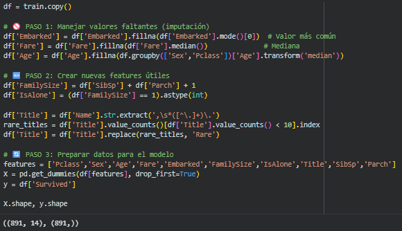
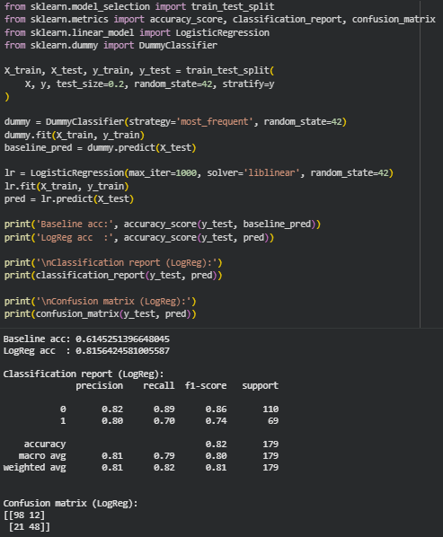

# Cómo mejorar el modelo del Titanic con Feature Engineering y un primer modelo base

---

## 📝 Contexto

En la práctica anterior trabajé el EDA del Titanic, mirando el dataset, entendiendo las variables y empezando a sacar las primeras conclusiones.  
En esta práctica el foco cambia: ahora me meto en **feature engineering** y en armar un **primer modelo base** que me sirva de referencia para saber si voy bien encaminado o no.

La idea es pasar de “explorar datos” a “preparar datos para un modelo real” y comparar una Regresión Logística con un baseline muy simple.

---

## 🎯 Objetivos

En esta práctica busco:

- Entender mejor algunos componentes de Scikit-learn: `LogisticRegression`, `DummyClassifier`, `train_test_split` y las métricas de clasificación.
- Aplicar **feature engineering simple** sobre el mismo dataset del Titanic para generar nuevas columnas que aporten información.
- Entrenar un modelo baseline y un modelo de Regresión Logística, y compararlos.
- Mirar la matriz de confusión y el classification report para entender **cómo** se equivoca el modelo, no solo cuánto acierta.

---

## 🚀 Desarrollo

### 0️⃣ Investigación rápida de Scikit-learn

Antes de tocar código me detuve a leer un poco la documentación oficial de Scikit-learn:

- `LogisticRegression`:  
  Sirve para problemas de **clasificación binaria**, como este caso de sobrevivió / no sobrevivió. Me quedo con que parámetros como `solver`, `C`, `penalty` y `max_iter` son importantes. El solver `liblinear` es una buena opción cuando tengo datasets no tan grandes y varias variables binarias.

- `DummyClassifier`:  
  Es un modelo “tonto” a propósito. Sirve como **baseline**, para ver qué pasa si siempre predigo la clase más frecuente o si predigo al azar. Si mi modelo “serio” no supera esto, es señal de alarma.

- `train_test_split`:  
  Se usa para separar en train y test.  
  - `stratify=y` lo uso para mantener las proporciones de clases.  
  - `random_state` me permite repetir los resultados.  
  - En este caso usé `test_size=0.2`, que es bastante estándar.

- Métricas de evaluación:  
  El `classification_report` me da precision, recall y f1-score por clase. La **matriz de confusión** me muestra exactamente cuántos aciertos y errores hay en cada categoría. La accuracy está buena, pero en problemas desbalanceados no alcanza con mirarla solo a ella.

---

### 1️⃣ Feature Engineering

A partir del dataset `train` hice una copia en `df` y trabajé sobre esa. Los pasos fueron:

#### 🧹 Manejo de valores faltantes (imputación)

- `Embarked`: reemplacé los nulos por la **moda** (el valor más frecuente).  
- `Fare`: reemplacé los nulos por la **mediana**.  
- `Age`: imputé la edad agrupando por `Sex` y `Pclass`, usando la mediana de cada grupo.

La intención es que el modelo no pierda filas por valores faltantes, pero que la imputación también tenga algo de sentido.

#### 🧱 Creación de nuevas features

Después generé algunas columnas nuevas:

- `FamilySize = SibSp + Parch + 1` → tamaño de la familia viajando junta.  
- `IsAlone` → una bandera que indica si la persona viajaba sola (`FamilySize == 1`).  
- `Title` → extraído desde la columna `Name`, y luego agrupé títulos poco frecuentes bajo la categoría `Rare`.

Estas features nuevas intentan capturar información más “humana” del problema: si viajás solo, con familia, tu título social, etc.

#### 🔄 Preparación final para el modelo

Definí la lista de columnas a usar como features:

```python
features = ['Pclass','Sex','Age','Fare','Embarked',
            'FamilySize','IsAlone','Title','SibSp','Parch']
```

Luego hice pd.get_dummies para pasar las variables categóricas a numéricas y definí:

- X → features ya codificadas
- y → la variable objetivo Survived

El resultado final fue:

- X: 891 filas y 14 columnas
- y: 891 registros de la variable objetivo

---

### 2️⃣ Modelo base y baseline

Acá entran en juego los modelos.

Primero separé el dataset en train y test:

X_train, X_test, y_train, y_test = train_test_split(
    X, y, test_size=0.2, random_state=42, stratify=y
)

#### 🎯 Baseline — DummyClassifier

Entrené un DummyClassifier con estrategia most_frequent, que básicamente siempre predice la clase mayoritaria (“no sobrevivió”). Esto es mi piso.

#### 🤖 Modelo principal — LogisticRegression

Luego entrené una LogisticRegression con:

- max_iter=1000
- solver='liblinear'
- random_state=42

Finalmente comparé accuracies, el classification report y la matriz de confusión.

Los resultados que obtuve fueron:

- Baseline accuracy: ~0.61
- Logistic Regression accuracy: ~0.82
- La Regresión Logística mejora bastante el baseline, lo cual tiene sentido porque está usando toda la información de las features nuevas.

## ❓ Preguntas finales

🔸 1. Matriz de confusión: ¿en qué casos se equivoca más el modelo?

La matriz de confusión del modelo de Regresión Logística fue:

- Verdaderos negativos: 98
- Falsos positivos: 12
- Falsos negativos: 21
- Verdaderos positivos: 48

El modelo se equivoca más cuando predice que alguien NO sobrevivió pero en realidad sí sobrevivió (falsos negativos = 21), frente a los falsos positivos (12).

🔸 2. Clases atendidas: ¿acierta más en los que sobrevivieron o en los que no?

Acierta más en la clase “no sobrevivió”, porque:

- Tiene más ejemplos en el dataset.
- Es la clase mayoritaria, así que el modelo tiende a predecirla mejor.

En la práctica, eso se ve tanto en la matriz como en el classification report.

🔸 3. Comparación con baseline

Sí, la Regresión Logística supera ampliamente al baseline:

- Baseline (siempre clase más frecuente): ~61%
- Regresión Logística: ~82%

Esto me confirma que el feature engineering + el modelo logístico están captando patrones reales del problema y no solo “repitiendo la clase que más aparece”.

🔸 4. ¿Qué error es más grave para este problema?

En este contexto, podríamos discutirlo, pero personalmente me parece más grave el falso negativo: cuando el modelo dice “no sobrevive” y en realidad la persona sí sobrevivió.
En una versión más seria del problema (por ejemplo, simulaciones para protocolos de evacuación), subestimar la supervivencia de ciertas personas podría llevar a decisiones injustas o peligrosas.

🔸 5. Observaciones generales

- Las nuevas features (FamilySize, IsAlone, Title) aportan información y ayudan al modelo.
- La clase y el sexo siguen siendo variables muy relevantes.
- El salto desde el baseline (~0.61) hasta la LogReg (~0.82) muestra lo importante del feature engineering.

🔸 6. Mejoras simples para el futuro

Una idea clara de mejora es trabajar con la información de la cabina (Cabin), por ejemplo extrayendo la letra de la cabina como indicador de zona del barco. También se podría seguir refinando los títulos (Title) y hacer más pruebas de combinación de features.

## 📸 Evidencias

[Enlace al notebook](https://colab.research.google.com/drive/13l-o1ZTeMMskTwmTqSLBpcZ3vQ1-3veP?usp=sharing)

### 📊 Salidas clave

Código de feature engineering, preparación de X e y más resultado:

{ width="480" }

Accuracy del baseline y de la Regresión Logística + classification_report junto con Matriz de confusión del modelo de Regresión Logística:

{ width="480" }

## 💡 Reflexión

Este práctico me ayudó a ver en la práctica algo que muchas veces se dice de memoria:
el modelo es importante, pero la preparación de los datos lo es todavía más.

Pasar de un baseline muy tonto a una Regresión Logística bien alimentada con features creadas a mano cambia por completo el rendimiento. Me gustó ver cómo decisiones bastante simples (imputar bien, crear columnas nuevas, codificar categorías) tienen un impacto directo en los resultados.

Siento que, sumando este práctico al anterior, ya tengo una idea más concreta del flujo:

- Entender los datos (EDA).
- Prepararlos y enriquecerlos (feature engineering).
- Probar un modelo base y compararlo con un baseline.

Esto me da una base real para después pasar a modelos más complejos sin hacer “magia negra”.

## 📚 Referencias

- [Documentación de Scikit-learn – Logistic Regression](https://scikit-learn.org/stable/modules/linear_model.html#logistic-regression)
- [Documentación de Scikit-learn – DummyClassifier](https://scikit-learn.org/stable/modules/generated/sklearn.dummy.DummyClassifier.html#sklearn.dummy.DummyClassifier)
- [Documentación de Scikit-learn – train_test_split](https://scikit-learn.org/stable/modules/generated/sklearn.model_selection.train_test_split.html#sklearn.model_selection.train_test_split)