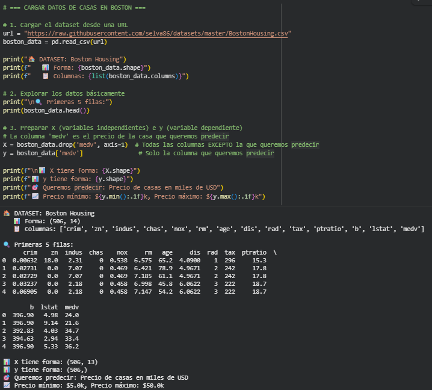
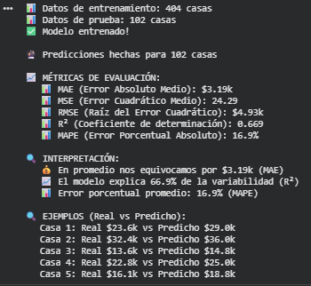
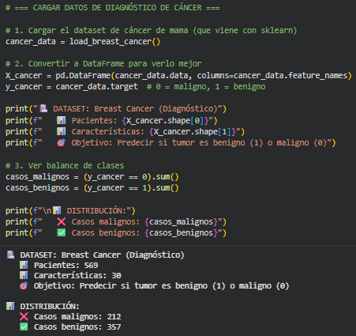
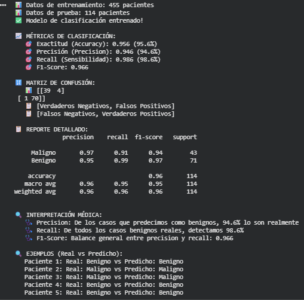

# De precios de casas a diagnóstico médico: regresión lineal y logística paso a paso

---

## 📝 Contexto

En esta tercera práctica de la UT1 trabajé dos modelos clásicos y fundamentales del Machine Learning:  
**la Regresión Lineal** (para predecir números continuos) y **la Regresión Logística** (para clasificar en categorías).

La práctica estuvo dividida en dos partes bien distintas:

1. **Predicción de precios de casas en Boston**  
2. **Diagnóstico de cáncer de mama utilizando clasificación binaria**

Este práctico fue más "hands-on" que los anteriores, porque no solo probé modelos sino que tuve que interpretar varias métricas esenciales y entender qué significan en un contexto real.

Los resultados y salidas que aparecen abajo provienen directamente del notebook que ejecuté en Google Colab.

---

## 🎯 Objetivos

- Implementar **regresión lineal** usando un dataset real de viviendas.  
- Implementar **regresión logística** para clasificación médica.  
- Entender las métricas: MAE, MSE, RMSE, R², accuracy, precision, recall y F1.  
- Comparar los dos tipos de modelos en contexto de negocio.  
- Interpretar los resultados de forma clara y aplicada.

---

## 🚀 Desarrollo


### 🏠 Parte 1 – Regresión Lineal: Predicción de Precios de Casas en Boston

Para esta parte usé un dataset clásico de Boston Housing. Se trata de predecir el precio de casas (variable **medv**) a partir de 13 características del barrio.

#### 🔧 Preparación del dataset

Primero cargué el dataset desde un repositorio público y armé las variables:

- **X**: todas las columnas menos `medv`  
- **y**: la columna `medv` (precio en miles de dólares)

Forma de los datos:

- 📊 X tiene forma: (506, 13)
- 📊 y tiene forma: (506,)

#### 🤖 Entrenamiento

Después separé en train/test y entrené un modelo de **LinearRegression()**.  
El modelo se entrenó sin problemas y generó predicciones para 102 casas.

---

#### 📈 Resultados de Regresión Lineal

Resultados obtenidos del notebook:

- **MAE:** 3.19k  
- **MSE:** 24.29  
- **RMSE:** 4.93k  
- **R²:** 0.669  
- **MAPE:** 16.9%

Esto quiere decir:

- En promedio el modelo se equivoca unos **3.19 mil dólares**.
- Explica un **66.9%** de la variabilidad del precio.
- El error porcentual ronda el **17%**, razonable para un modelo lineal básico sin tuning.

#### 🔍 Ejemplos (Real vs Predicho)

- Casa 1: Real $23.6k vs Predicho $29.0k  
- Casa 2: Real $32.4k vs Predicho $36.0k  
- Casa 3: Real $13.6k vs Predicho $14.8k  
- Casa 4: Real $22.8k vs Predicho $25.0k  
- Casa 5: Real $16.1k vs Predicho $18.8k  

En general el modelo tiende a **sobreestimar** un poco los valores.

---

### 🏥 Parte 2 – Regresión Logística: Diagnóstico de Cáncer de Mama

Acá trabajé con el famoso dataset de cáncer de mama de Wisconsin, que ya viene incluido en Scikit-learn.

El objetivo fue clasificar tumores entre:

- **0 = maligno**
- **1 = benigno**

Usé **30 características** de núcleos celulares para entrenar la regresión logística.

#### 📊 Balance del dataset

- Casos malignos: **212**  
- Casos benignos: **357**

---

#### 🤖 Entrenamiento y Predicciones

Entrené una regresión logística con:

```python
LogisticRegression(max_iter=5000, random_state=42)
```

Luego evalué con accuracy, precision, recall y F1-score.

#### 📈 Resultados de Regresión Logística

Resultados extraídos del notebook:

- **Accuracy:** 95.6%  
- **Precision:** 94.6%  
- **Recall:** 98.6%  
- **F1-Score:** 0.966

#### 🔢 Matriz de Confusión

```text
[[39  4]
 [ 1 70]]
```

Interpretación:

- **39 verdaderos negativos** → malignos correctamente clasificados  
- **70 verdaderos positivos** → benignos correctamente clasificados  
- **4 falsos positivos**  
- **1 falso negativo** (el error más delicado en medicina)

---

## ❓ Respuestas a preguntas clave

### 🔸 Diferencia principal entre regresión lineal y logística

- La **lineal** predice números continuos (precios, cantidades).  
- La **logística** predice categorías (clases), usando probabilidades.

### 🔸 ¿Por qué dividimos los datos en entrenamiento y prueba?

Para poder evaluar el modelo en datos que no vio durante el entrenamiento.  
Esto evita caer en el overfitting y nos permite medir desempeño real.

### 🔸 ¿Qué significa una exactitud del 95%?

Que si el modelo analiza 100 pacientes, acertaría aproximadamente **95 diagnósticos**.

### 🔸 ¿Qué error es más peligroso en este caso?

El **falso negativo** (esto es: un caso maligno clasificado como benigno).  
En medicina es crítico porque significa *no detectar un cáncer real*.

---

### 📊 Comparación Lineal vs Logística

| Aspecto | Regresión Lineal | Regresión Logística |
|--------|------------------|---------------------|
| Qué predice | valores continuos | clases / categorías |
| Ejemplo | precio de casas | diagnóstico benigno/maligno |
| Rango de salida | números reales | probabilidad 0–1 |
| Métrica principal | MAE, RMSE, R² | accuracy, precision, recall, F1 |

---

## 📸 Evidencias

[Enlace al notebook](https://colab.research.google.com/drive/16KhjpsCtSxNYRGjX4L2uMB3j1vsDuZRp?usp=sharing)

A continuación presento algunas salidas clave del notebook ejecutado en Google Colab, incluyendo carga de datos, preparación, métricas y resultados finales de ambos modelos.

### 🏠 Regresión Lineal – Boston Housing

{ width="480" }

{ width="480" }

### 🏥 Regresión Logística – Diagnóstico de Cáncer de Mama

{ width="480" }

{ width="480" }

---

## 💡 Reflexión

Esta práctica me ayudó a ver de forma clara cómo funcionan dos enfoques distintos dentro del Machine Learning:  
uno orientado a **predecir valores continuos** (regresión lineal) y otro a **clasificar categorías** (regresión logística).

También trabajé por primera vez con métricas específicas para regresión (MAE, RMSE, R²) y otras completamente diferentes para clasificación (accuracy, precision, recall, F1). Esto refuerza una idea clave: **no existe una única forma de evaluar un modelo**, todo depende del tipo de problema.

En el caso del diagnóstico médico, entendí por qué el *recall* es tan importante: queremos minimizar los falsos negativos porque representan casos malignos que pasarían desapercibidos.

En conjunto, esta práctica cierra muy bien la UT1, porque une exploración de datos, modelos predictivos y modelos clasificadores dentro de un mismo flujo.

---

## 📚 Referencias

- [Documentación de LinearRegression (Scikit-learn)](https://scikit-learn.org/stable/modules/generated/sklearn.linear_model.LinearRegression.html)
- [Documentación de LogisticRegression (Scikit-learn)](https://scikit-learn.org/stable/modules/generated/sklearn.linear_model.LogisticRegression.html)
- [Documentación de train_test_split](https://scikit-learn.org/stable/modules/generated/sklearn.model_selection.train_test_split.html)
- [Métricas de Clasificación – Guía Oficial Scikit-learn](https://scikit-learn.org/stable/modules/model_evaluation.html#classification-metrics)
- [Métricas de Regresión – Guía Oficial Scikit-learn](https://scikit-learn.org/stable/modules/model_evaluation.html#regression-metrics)
- [Dataset Boston Housing – Descripción (Kaggle)](https://www.kaggle.com/datasets/selva86/boston-housing)
- [Breast Cancer Wisconsin Dataset – Documentación Scikit-learn](https://scikit-learn.org/stable/datasets/toy_dataset.html#breast-cancer-dataset)
- [Paper original – Boston Housing (Harrison & Rubinfeld, 1978)](https://www.jstor.org/stable/1913643)
- [Paper original – Breast Cancer Wisconsin (Wolberg et al., 1995)](https://doi.org/10.1007/BF00165653)
- [Tutorial Regresión Lineal – Scikit-learn User Guide](https://scikit-learn.org/stable/modules/linear_model.html#ordinary-least-squares)
- [Tutorial Regresión Logística – Scikit-learn User Guide](https://scikit-learn.org/stable/modules/linear_model.html#logistic-regression)

