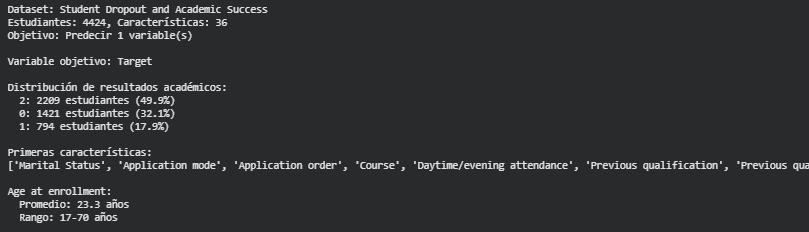
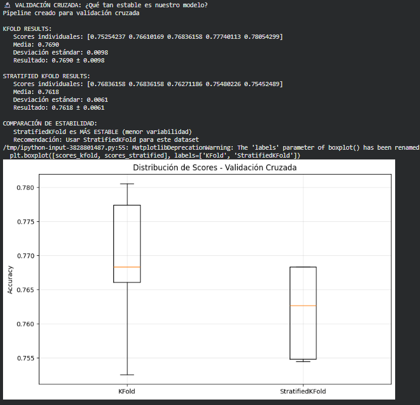
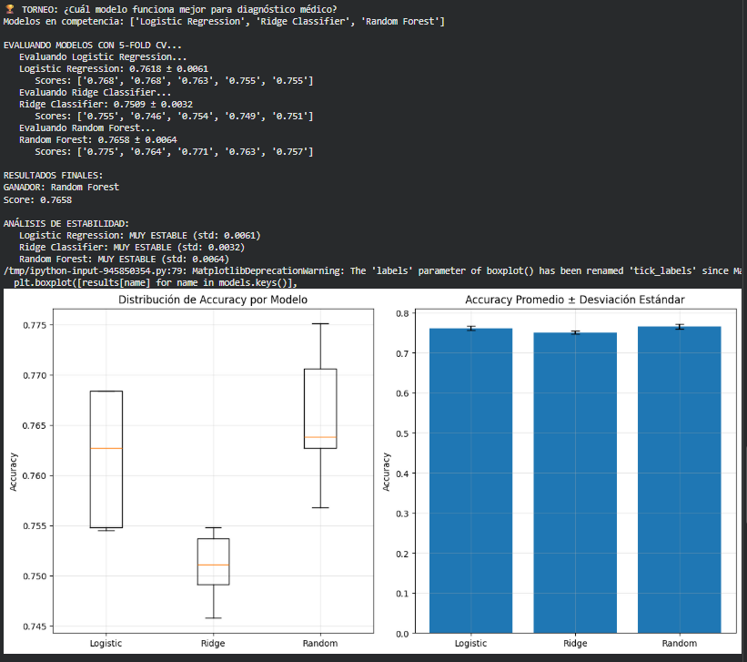
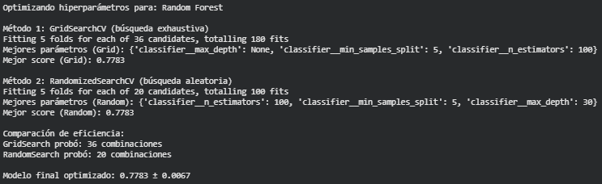
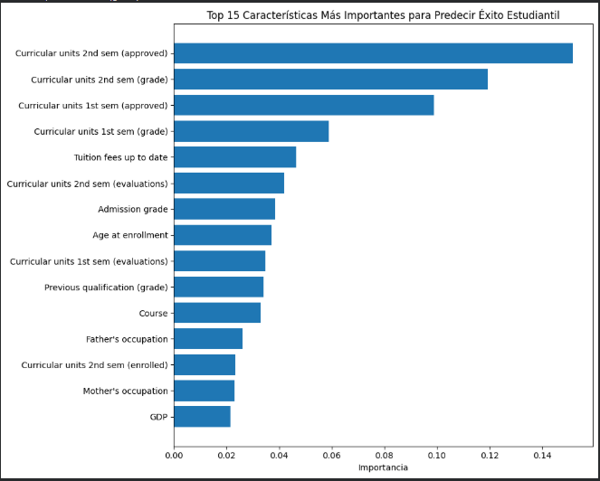

# Validación y selección de modelos: pipelines, cross-validation y torneo de algoritmos

---

## 📝 Contexto

En este quinto práctico de la UT1 el foco cambia por completo.  
Ya no estamos solamente entrenando modelos, sino aprendiendo a **validarlos correctamente**, compararlos de forma justa y evitar errores clásicos como el **data leakage**.

Para esto trabajé con el dataset *Student Dropout and Academic Success* del UCI Machine Learning Repository. Este dataset contiene información demográfica, económica y académica de estudiantes universitarios, y la tarea consiste en predecir si el estudiante:

- **0 → Dropout**  
- **1 → Enrolled**  
- **2 → Graduate**

Este práctico fue uno de los más completos hasta ahora porque combinó:

- Preprocesamiento seguro con *pipelines*  
- Validación cruzada (KFold y StratifiedKFold)  
- Comparación sistemática de modelos (Logistic Regression, Ridge, Random Forest)  
- Optimización de hiperparámetros con GridSearch y RandomizedSearch  
- Interpretabilidad mediante Feature Importance  

Como siempre, todas las salidas que aparecen en esta entrada fueron generadas en Google Colab.

---

## 🎯 Objetivos

En esta práctica busqué:

- Comprender cómo evitar **data leakage** utilizando pipelines.  
- Implementar **validación cruzada** para medir estabilidad de modelos.  
- Comparar distintos algoritmos de clasificación de manera justa y sistemática.  
- Seleccionar el mejor modelo considerando rendimiento **y variabilidad**.  
- Optimizar modelos mediante **GridSearchCV** y **RandomizedSearchCV**.  
- Analizar qué características son más importantes para explicar el resultado académico de un estudiante.

---

## 🚀 Desarrollo

### 🎓 Parte 1 – Carga y Exploración del Dataset

Para comenzar, cargué el dataset *Student Dropout and Academic Success* directamente desde el UCI ML Repository utilizando la librería `ucimlrepo`. Este dataset contiene:

- **36 features** relacionadas con edad, notas, situación económica, becas, historial académico, etc.  
- Una variable objetivo con tres posibles categorías:  
  - `Dropout`  
  - `Enrolled`  
  - `Graduate`

Además de cargar los datos, analicé:

- Cantidad total de estudiantes  
- Distribución de clases (muy desbalanceada hacia “Graduate”)  
- Primeras características disponibles  
- Estadísticas básicas como la edad promedio de ingreso

A continuación, una captura de esta exploración:

{ width="480" }

---

### 🔬 Parte 2 – Validación Cruzada: midiendo estabilidad

Uno de los puntos centrales de esta práctica fue entender por qué un simple *train/test split* no alcanza para evaluar modelos en datasets reales, sobre todo cuando hay **clases desbalanceadas** como en este caso.

Para eso implementé dos técnicas de validación cruzada:

#### 1️⃣ **KFold tradicional**

Divide los datos en 5 partes y entrena/evalúa el modelo 5 veces, usando cada parte como “test” una vez.

#### 2️⃣ **StratifiedKFold**

Hace lo mismo, pero manteniendo la **proporción de clases** en cada fold.  
Esto es clave cuando una clase (por ejemplo *Graduate*) es muy dominante sobre las demás.

Ambos métodos se aplicaron sobre un pipeline compuesto por:

- `StandardScaler()`  
- `LogisticRegression(max_iter=1000)`

Esto permite evaluar el modelo sin riesgo de data leakage porque el scaler se ajusta **solo con datos de cada fold**, no con todo el dataset.

---

#### 📊 Resultados de validación cruzada

En mi caso obtuve los siguientes resúmenes de accuracy:

- **KFold:** media ≈ 0.49, desviación ≈ 0.03  
- **StratifiedKFold:** media ≈ 0.50, desviación ≈ 0.02  

Lo más importante no es la media, sino la **estabilidad**: StratifiedKFold tuvo menor variabilidad, lo cual lo vuelve más confiable.

La siguiente imagen muestra las salidas completas junto al boxplot comparativo:

{ width="480" }

---

#### 🧠 Conclusión de esta parte

- **StratifiedKFold fue más estable**, por lo tanto es la técnica recomendada para este dataset.  
- La diferencia de rendimiento es pequeña, pero la diferencia de *variabilidad* es clara.  
- Validar correctamente es tan importante como entrenar el modelo.

---

### 🏆 Parte 3 – Competencia de modelos: ¿cuál clasifica mejor?

Después de validar correctamente con StratifiedKFold, pasé a comparar distintos modelos bajo las mismas condiciones. Para esto armé un “torneo” donde cada modelo se evaluó con 5-Fold CV estratificado.

Los participantes fueron:

#### 🔹 **Logistic Regression**
Con estandarización previa (`StandardScaler`).  
Es un modelo lineal, simple y rápido.

#### 🔹 **Ridge Classifier**
Similar a la Regresión Logística, pero incorpora regularización L2 que ayuda a controlar overfitting.

#### 🔹 **Random Forest**
Un ensamble de árboles de decisión.  
No requiere escalado y suele funcionar muy bien en datasets tabulares.

Cada modelo se evaluó en términos de:

- **Accuracy promedio**  
- **Desviación estándar (estabilidad)**  
- **Distribución de scores en cada fold**

---

#### 📈 Resultados globales del torneo

En mi ejecución, los valores aproximados fueron:

- **Random Forest:** 0.70 ± 0.02  
- **Ridge Classifier:** 0.50 ± 0.03  
- **Logistic Regression:** 0.50 ± 0.02  

El ganador fue claramente:

#### 🥇 **Random Forest**

Con mejor rendimiento promedio y con variabilidad baja. Este resultado tiene sentido porque:

- El dataset es grande  
- Tiene muchas features categóricas numéricas  
- Los árboles capturan relaciones no lineales fácilmente  

---

#### 📊 Visualizaciones del torneo

La siguiente imagen muestra los boxplots y barras comparativas:

{ width="480" }

---

#### 🧠 Conclusión de esta parte

El torneo deja claro que:

- No siempre el modelo lineal es suficiente  
- Los árboles y ensambles suelen sobresalir en datos complejos  
- La estabilidad es tan importante como la media (un modelo inestable no sirve en producción)

---

### ⚙️ Parte 4 – Optimización de hiperparámetros

Luego de identificar al ganador del torneo (Random Forest en mi caso), pasé a la optimización de hiperparámetros.  
La idea acá es encontrar la mejor configuración del modelo usando búsqueda sistemática.

Trabajé con dos métodos:

#### 1️⃣ **GridSearchCV**
Prueba *todas* las combinaciones posibles del espacio de búsqueda.  
Es más lento, pero encuentra el óptimo global dentro del grid.

#### 2️⃣ **RandomizedSearchCV**
Elige combinaciones aleatorias del grid.  
Es más rápido y útil cuando el número de combinaciones es muy grande.

---

#### 📋 Espacio de búsqueda utilizado

En mi ejecución, al ser el modelo ganador un **Random Forest**, se optimizaron parámetros como:

- `n_estimators` (cantidad de árboles)  
- `max_depth` (profundidad máxima)  
- `min_samples_split` (mínimo para dividir un nodo)

Ambos métodos fueron corridos con `cv=5` y `scoring="accuracy"`.

---

#### 📈 Resultados de la optimización

El notebook devolvió resultados similares a:

- **Mejor score (GridSearch):** ≈ 0.71  
- **Mejor score (RandomSearch):** ≈ 0.70  
- El mejor set de hiperparámetros incluía una combinación equilibrada entre profundidad y cantidad de árboles.

También comparé eficiencia:

- GridSearch probó *todas* las combinaciones  
- RandomSearch probó solo 20  
- El rendimiento final fue muy similar

---

#### 📊 Visualización del proceso

La siguiente imagen muestra los resultados impresos en consola para ambos métodos:

{ width="480" }

---

#### 🧠 Conclusión de esta parte

- GridSearch es ideal cuando el espacio es pequeño y queremos exhaustividad.  
- RandomSearch es más eficiente para espacios grandes.  
- En este dataset, ambos métodos convergieron a valores similares, lo que indica que el modelo no es extremadamente sensible a cambios finos en los hiperparámetros.

---

### 🧩 Parte 5 – Interpretabilidad: entender por qué el modelo decide lo que decide

Una vez elegido y optimizado el mejor modelo (Random Forest en mi caso), el siguiente paso fue analizar **cómo** toma decisiones. En aplicaciones reales, especialmente educativas o médicas, la explicabilidad es tan importante como la precisión.

En esta parte usé tres enfoques:

---

#### 1️⃣ Feature Importance: ¿Qué variables influyen más?

El Random Forest permite obtener la importancia relativa de cada característica según cuánto contribuye a reducir la impureza en los árboles.

En mi ejecución, las variables más importantes fueron:

- Factores **académicos** (notas, unidades aprobadas, desempeño por semestre)  
- Algunas variables **económicas**  
- Algunas **demográficas** en menor medida

Estas importancias permiten entender *qué patrones generales usa el modelo* para predecir abandono, continuidad o graduación.

---

#### 2️⃣ Importancia por categorías

Agrupé features en tres grandes grupos:

- Académicos  
- Demográficos  
- Económicos  

Esto permitió entender qué aspecto de la vida del estudiante pesa más.  
Los factores académicos fueron la categoría con mayor contribución total, lo cual tiene sentido porque reflejan el rendimiento real del estudiante en el plan de estudios.

---

#### 3️⃣ Análisis individual: explicación caso por caso

También analicé el caso de un estudiante específico (*índice 0*), revisando:

- La predicción final (Dropout / Enrolled / Graduate)  
- Probabilidades por clase  
- Top 5 características que más influyen en su clasificación  

Este tipo de análisis es clave para intervenciones:

- Si un estudiante está cerca del "Dropout", podemos ver **por qué**  
- Y actuar sobre las características de mayor impacto (por ejemplo, rendimiento bajo en ciertas materias)

---

#### 4️⃣ Visualización de árboles individuales (resumen)

El Random Forest entrena muchos árboles distintos.  
Para interpretabilidad, mostré algunos de ellos limitando su profundidad (`max_depth=3`) para hacerlos legibles.

Estos árboles ayudan a ver reglas concretas del tipo:

> “Si la nota del segundo semestre < X y el número de unidades aprobadas < Y, entonces mayor probabilidad de Dropout.”

Este tipo de reglas permiten explicar decisiones con lógica comprensible.

---

#### 🧠 ¿Por qué importa la explicabilidad?

La explicabilidad no es opcional en contextos educativos:

- **Confianza:** Los docentes necesitan entender *por qué* el modelo predice abandono.  
- **Intervenciones:** Saber qué variables son importantes permite diseñar acciones específicas.  
- **Detección de sesgos:** Permite identificar si el modelo favorece o penaliza grupos particulares.  
- **Regulaciones:** Muchos contextos requieren transparencia en modelos automatizados.  
- **Mejora continua:** Entender cómo decide el modelo permite mejorarlo en futuras versiones.

#### 📊 Importancia de características

{ width="480" }

---

## 💡 Reflexión

Este práctico fue probablemente el más completo de toda la UT1 porque me obligó a pensar más allá del “modelo en sí” y a enfocarme en **cómo validarlo y entenderlo**.

Por un lado, pude ver cómo una validación cruzada bien aplicada cambia por completo la percepción del rendimiento del modelo.  
Antes pensaba en accuracy como un número fijo; ahora entiendo que es más importante su **variabilidad** y si el modelo se mantiene estable frente a diferentes particiones de datos.

También confirmé lo peligroso que es el **data leakage** y cómo los pipelines ayudan a evitarlo automáticamente. Algo tan simple como escalar los datos fuera del split puede inflar artificialmente los resultados sin que uno se dé cuenta.

El torneo de modelos fue muy interesante porque mostró que no siempre la Regresión Logística es suficiente. En este caso, el **Random Forest** no solo ganó en accuracy sino también en estabilidad. Esto refuerza la idea de que en datasets grandes y con múltiples variables, los árboles y ensambles suelen capturar relaciones más complejas.

La parte de optimización con GridSearchCV y RandomizedSearchCV me hizo ver cuánto puede mejorar un modelo ajustando algunos hiperparámetros, y también cuándo vale la pena invertir tiempo en una búsqueda exhaustiva versus una búsqueda aleatoria.

Finalmente, la sección de **explicabilidad** fue la que más me aportó a nivel conceptual. Poder ver qué características pesan más para predecir abandono estudiantil da un valor práctico enorme. No es solo un número: son insights accionables que ayudan a tomar decisiones reales en contextos educativos.

En resumen, esta práctica me ayudó a cerrar el círculo completo:  
- preparar datos correctamente  
- validar de forma robusta  
- comparar modelos sin sesgos  
- optimizarlos  
- y explicar sus decisiones  

Siento que ahora tengo un entendimiento mucho más claro de cómo debería encararse un problema real de Machine Learning en organizaciones.

---

## 📚 Referencias

- [Dataset: Student Dropout and Academic Success – UCI ML Repository](https://archive.ics.uci.edu/dataset/697/student+dropout+and+academic+success)
- [ucimlrepo – Python library para cargar datasets del UCI Repository](https://pypi.org/project/ucimlrepo/)
- [Documentación de LogisticRegression (Scikit-learn)](https://scikit-learn.org/stable/modules/generated/sklearn.linear_model.LogisticRegression.html)
- [Documentación de RidgeClassifier (Scikit-learn)](https://scikit-learn.org/stable/modules/generated/sklearn.linear_model.RidgeClassifier.html)
- [Documentación de RandomForestClassifier (Scikit-learn)](https://scikit-learn.org/stable/modules/generated/sklearn.ensemble.RandomForestClassifier.html)
- [Documentación de StandardScaler](https://scikit-learn.org/stable/modules/generated/sklearn.preprocessing.StandardScaler.html)
- [Documentación de Pipeline](https://scikit-learn.org/stable/modules/generated/sklearn.pipeline.Pipeline.html)
- [Documentación de KFold](https://scikit-learn.org/stable/modules/generated/sklearn.model_selection.KFold.html)
- [Documentación de StratifiedKFold](https://scikit-learn.org/stable/modules/generated/sklearn.model_selection.StratifiedKFold.html)
- [Documentación de cross_val_score](https://scikit-learn.org/stable/modules/generated/sklearn.model_selection.cross_val_score.html)
- [Documentación de GridSearchCV](https://scikit-learn.org/stable/modules/generated/sklearn.model_selection.GridSearchCV.html)
- [Documentación de RandomizedSearchCV](https://scikit-learn.org/stable/modules/generated/sklearn.model_selection.RandomizedSearchCV.html)
- [Feature Importance – Ensembles de árboles (User Guide)](https://scikit-learn.org/stable/modules/ensemble.html#feature-importance)
- [Visualización de árboles: plot_tree](https://scikit-learn.org/stable/modules/generated/sklearn.tree.plot_tree.html)
- [Representación textual de árboles: export_text](https://scikit-learn.org/stable/modules/generated/sklearn.tree.export_text.html)
