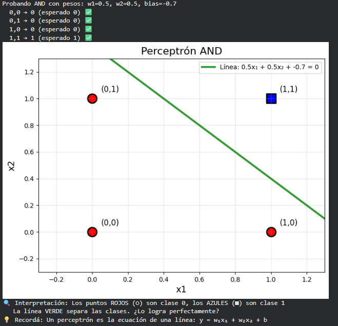
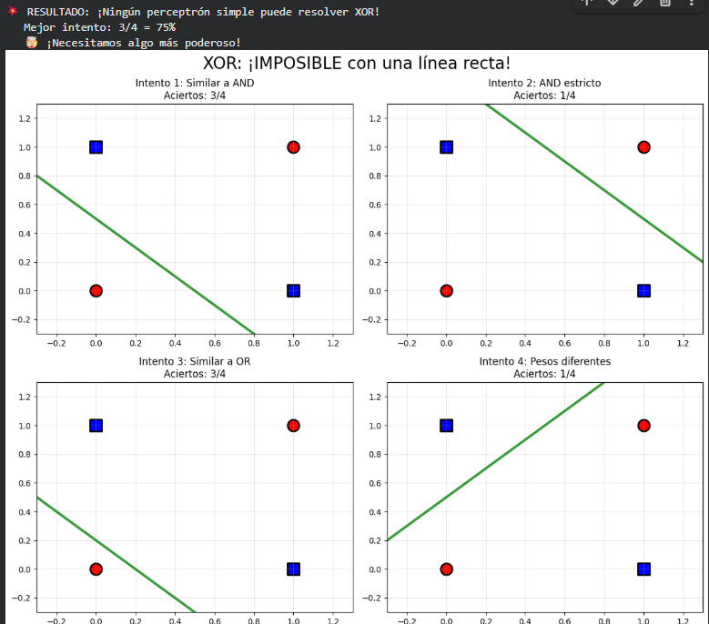
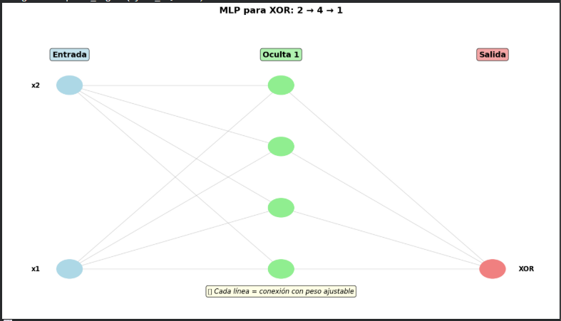
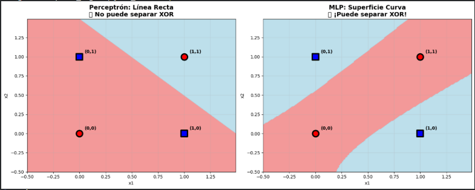

# De Perceptrón a Redes Neuronales: XOR, MLPs y Deep Learning

---

## 📝 Contexto

En este séptimo práctico dimos un salto fundamental en la materia: pasamos de los modelos lineales clásicos a las bases del **Deep Learning**.

El trabajo comenzó implementando desde cero un **Perceptrón simple** para entender su funcionamiento interno (pesos, bias, función de activación escalón). Sin embargo, el punto de inflexión fue chocar con su gran limitación histórica: la incapacidad de resolver problemas no linealmente separables, como la compuerta **XOR**.

Para superar esto, evolucionamos hacia **Redes Neuronales Multicapa (MLP)**, primero utilizando `scikit-learn` para entender la arquitectura básica, y luego migrando a frameworks profesionales como **TensorFlow/Keras** y **PyTorch Lightning**.

Este práctico fue clave para entender por qué necesitamos "capas ocultas" y cómo herramientas modernas automatizan el cálculo de gradientes y la retropropagación (*backpropagation*) que antes eran manuales.

Como siempre, el código y las visualizaciones fueron generados en Google Colab.

---

## 🎯 Objetivos

En esta práctica busqué:

- Comprender la matemática y lógica detrás del **Perceptrón Simple**.
- Visualizar las **fronteras de decisión** lineales y entender sus límites (problema XOR).
- Implementar una **Red Neuronal Multicapa (MLP)** para resolver problemas no lineales.
- Comparar implementaciones simples (`sklearn`) vs. profesionales (`TensorFlow`, `PyTorch`).
- Analizar curvas de aprendizaje (*Loss* y *Accuracy*) para detectar convergencia o overfitting.
- Entender el rol de las funciones de activación (`ReLU`, `Sigmoid`, `Tanh`) y optimizadores (`Adam`).

---

## 🚀 Desarrollo

### 🧠 Parte 1 – El Perceptrón y la Lógica Booleana

[cite_start]Para comenzar, implementé desde cero la función básica del perceptrón: una suma ponderada de las entradas más un sesgo (*bias*), pasada por una función de activación escalón[cite: 6, 7].

El objetivo fue probar si este modelo simple podía "aprender" las compuertas lógicas básicas. Ajustando manualmente los pesos ($w_1, w_2$) y el sesgo ($b$), obtuve los siguientes resultados:

#### 1️⃣ **Compuerta AND**
Requiere que ambas entradas sean 1 para activarse.
- [cite_start]**Configuración:** $w_1=0.5, w_2=0.5, bias=-0.7$[cite: 62].
- **Resultado:** El bias negativo alto actúa como un filtro estricto. [cite_start]El perceptrón trazó una línea que separó perfectamente el (1,1) del resto[cite: 102].

#### 2️⃣ **Compuerta OR**
Es más permisiva, se activa con cualquier 1.
- [cite_start]**Configuración:** $w_1=0.5, w_2=0.5, bias=-0.2$[cite: 130].
- **Resultado:** Al subir el bias (hacerlo menos negativo), la línea de decisión se desplazó, permitiendo que cualquiera de las entradas activara la neurona.

#### 3️⃣ **Compuerta NOT**
Un inversor simple de una sola entrada.
- [cite_start]**Configuración:** $w_1=-1.0, bias=0.5$[cite: 192].
- **Resultado:** Peso negativo para invertir la entrada. Funcionó perfecto.

A continuación, una visualización de cómo el perceptrón separó las clases en el caso AND:

{ width="480" }

---

### ❌ Parte 2 – El límite: el problema XOR

Después del éxito con las compuertas básicas, intenté resolver el problema **XOR (O Exclusivo)**. Aquí la salida debe ser 1 solo si las entradas son diferentes (0,1 o 1,0).

[cite_start]Realicé varios intentos manuales modificando los pesos y el bias para tratar de encontrar una línea que separara los puntos, pero fue **matemáticamente imposible**[cite: 314].

- [cite_start]**Mejor intento:** 75% de accuracy (3 de 4 aciertos)[cite: 318].
- **El problema:** Los puntos de la clase 0 (0,0 y 1,1) y los de la clase 1 (0,1 y 1,0) están dispuestos diagonalmente opuestos.
- [cite_start]**Conclusión visual:** No existe ninguna línea recta única que pueda dejar a los puntos rojos de un lado y a los azules del otro[cite: 370].

Esta limitación visualizó perfectamente por qué el perceptrón simple cayó en desuso en los años 60: **solo sirve para problemas linealmente separables**.

La siguiente imagen muestra cómo la línea recta falla inevitablemente en clasificar los 4 puntos del XOR:

{ width="480" }

---

### 🌊 Parte 3 – La solución: Redes Neuronales Multicapa (MLP)

Dado que una sola línea recta no era suficiente, la solución fue agregar **capas ocultas** para permitir que el modelo aprendiera fronteras de decisión no lineales.

Utilicé la clase `MLPClassifier` de `sklearn` para construir una pequeña red neuronal:

- **Arquitectura:** 2 entradas $\rightarrow$ 4 neuronas ocultas $\rightarrow$ 1 salida.
- **Activación:** `tanh` (tangente hiperbólica) para introducir no-linealidad.
- **Optimizador:** `Adam`.

**El resultado fue inmediato:** La red logró un **100% de Accuracy** en el problema XOR.

Al graficar la superficie de decisión, la diferencia fue visualmente impactante. Mientras el perceptrón intentaba trazar una recta inútil, el MLP generó una **curva suave** que aislaba perfectamente las zonas azules de las rojas. Esto confirmó que al combinar múltiples neuronas, la red puede "doblar" el espacio para clasificar correctamente datos complejos.

{ width="480" }

---

### 🤖 Parte 4 – Deep Learning Profesional con TensorFlow

Una vez entendida la teoría con `sklearn`, pasé a un entorno profesional utilizando **TensorFlow** y **Keras**. El objetivo era resolver un problema de clasificación más realista (dataset sintético con 1000 muestras y 20 características).

Diseñé una arquitectura secuencial (`Sequential`) más robusta:

1.  **Capa Oculta 1:** 64 neuronas con activación `ReLU`.
2.  **Capa Oculta 2:** 32 neuronas con activación `ReLU`.
3.  **Capa de Salida:** 1 neurona con activación `Sigmoid` (para obtener una probabilidad entre 0 y 1).

El entrenamiento se realizó durante 30 épocas monitoreando dos métricas clave:

- **Loss (Pérdida):** Bajó consistentemente hasta casi 0.
- **Accuracy (Precisión):** Alcanzó el **99.9%** en entrenamiento y **92.3%** en validación.

Este paso fue crucial para entender conceptos como **epochs** (cuántas veces la red ve los datos) y **batch_size** (lotes de procesamiento), que en `sklearn` suelen estar más abstraídos.

{ width="480" }

---

### ⚡ Parte 5 – PyTorch Lightning: Estructura y modularidad

Para cerrar la parte técnica, exploré **PyTorch Lightning**. A diferencia de Keras (que es muy directo), PyTorch requiere definir una clase que hereda de `pl.LightningModule`.

Esto fue interesante porque me obligó a estructurar el código de manera mucho más ordenada, definiendo explícitamente:
- El **`forward pass`** (cómo fluyen los datos).
- El **`training_step`** (cálculo de pérdida en entrenamiento).
- El **`test_step`** (evaluación y cálculo de accuracy).
- La configuración del optimizador (`Adam`).

Aunque requiere escribir más líneas de código que `sklearn` o `keras.Sequential`, la ventaja es la claridad: sabes exactamente qué está pasando en cada paso del entrenamiento. Implementé una red similar a la anterior y logré replicar los buenos resultados, confirmando que la arquitectura es robusta independientemente del framework.

---

## 📸 Evidencias

[Enlace al notebook](https://colab.research.google.com/drive/1MOKSu93vYAyQafwYsX4CJJ-R08GAOQjG?usp=sharing)

---

## 💡 Reflexión

Este práctico fue clave para desmitificar cómo "piensan" las redes neuronales.

Lo más impactante fue ver visualmente la **limitación del Perceptrón**. Una cosa es leer que "no resuelve problemas no lineales" y otra muy distinta es ver cómo la línea verde intenta desesperadamente separar el XOR y falla. Entendí que agregar **capas ocultas** no es solo "hacer la red más grande", sino darle la capacidad de **doblar el espacio** para crear fronteras de decisión complejas.

Respecto a las herramientas, me llevo una guía clara de cuándo usar cada una:
- **Scikit-learn (MLP):** Ideal para pruebas rápidas en datos tabulares simples donde no necesito control sobre el entrenamiento. Es una "caja negra" eficiente.
- **TensorFlow/Keras:** El estándar para producción. Me gustó poder ver las curvas de *Loss* en tiempo real y controlar los *epochs*.
- **PyTorch Lightning:** Se siente más "verborrágico" al principio, pero entiendo su valor para investigación o arquitecturas personalizadas donde necesitas control total sobre el bucle de entrenamiento.

Finalmente, validé la importancia de las funciones de activación. Sin `ReLU` o `Tanh` en las capas ocultas, no importa cuántas capas agregue, la red seguiría comportándose como un modelo lineal. La no-linealidad es el ingrediente secreto del Deep Learning.

---

## 📚 Referencias

- [Documentación de MLPClassifier (Scikit-learn)](https://scikit-learn.org/stable/modules/generated/sklearn.neural_network.MLPClassifier.html)
- [TensorFlow Keras Sequential Model](https://www.tensorflow.org/guide/keras/sequential_model)
- [PyTorch Lightning Documentation](https://lightning.ai/docs/pytorch/stable/)
- [Playground de TensorFlow (muy útil para visualizar)](https://playground.tensorflow.org/)
- [Explicación del problema XOR y Perceptrones](https://en.wikipedia.org/wiki/Perceptron#Limitations)