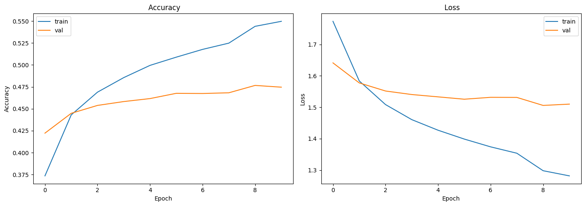
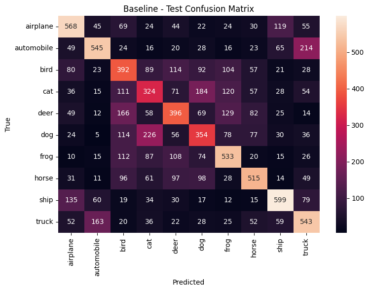
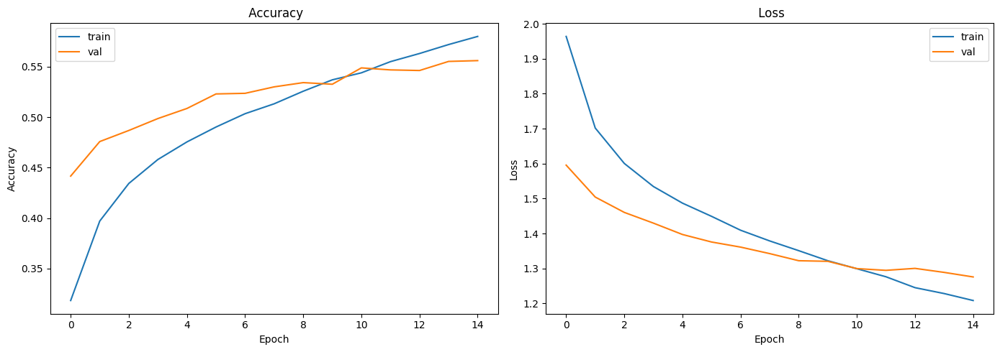
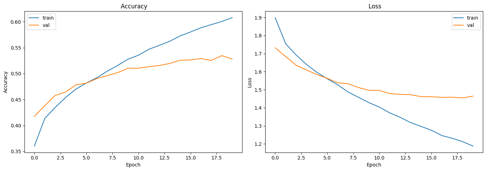
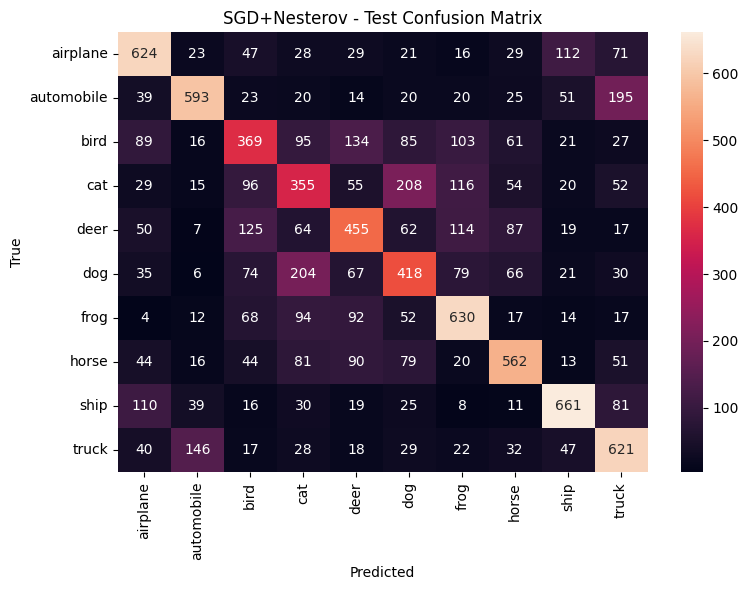

# Backpropagation y Optimizadores: MLPs sobre CIFAR-10

---

## 📝 Contexto

En este octavo práctico nos enfocamos en entender cómo se entrenan realmente las redes neuronales modernas mediante **backpropagation** y distintos **optimizadores**.

A diferencia de los prácticos anteriores, aquí trabajamos con un dataset real de visión por computadora: **CIFAR-10**, compuesto por 60.000 imágenes a color de 32×32 píxeles y 10 clases.

El objetivo principal fue construir y entrenar **MLPs (redes multicapa)** a partir de imágenes aplanadas, explorando:

- arquitecturas con diferente profundidad y número de neuronas,
- funciones de activación,
- regularización (Dropout, L2, BatchNorm),
- optimizadores como Adam, AdamW y SGD con momentum,
- y el uso de callbacks como EarlyStopping o ReduceLROnPlateau.

Todo el trabajo fue realizado en Google Colab.

## 🎯 Objetivos

En este práctico me propuse:

- Comprender el funcionamiento de **backpropagation** aplicado a redes multicapa.
- Entrenar modelos basados en **MLPs** utilizando imágenes del dataset CIFAR-10 aplanadas como vectores.
- Comparar distintos tipos de **arquitecturas** (profundidad, ancho, activaciones y regularización).
- Evaluar el impacto de **optimizadores modernos** como Adam, AdamW y SGD con momentum/Nesterov.
- Utilizar **callbacks** para mejorar la estabilidad del entrenamiento (EarlyStopping, ReduceLROnPlateau, ModelCheckpoint, TensorBoard).
- Analizar métricas clave como **accuracy**, **loss**, **matriz de confusión** y **classification report**.

## 🚀 Desarrollo

### 🧠 Parte 1 – Dataset CIFAR-10 y MLP baseline

El práctico comenzó trabajando con el dataset **CIFAR-10**, un conjunto de 60.000 imágenes a color de 32×32 píxeles distribuidas en 10 clases.  
Para poder entrenar una red neuronal multicapa (MLP), se realizó el siguiente preprocesamiento:

1. **Normalización** de las imágenes al rango `[-1, 1]` para facilitar el entrenamiento.
2. **Split del conjunto de validación** tomando el 10% inicial del set de entrenamiento.
3. **Aplanado de cada imagen** (32×32×3 → vector de 3072 valores) para usar capas densas.

Con estos datos se entrenó un primer modelo baseline muy sencillo:

- 2 capas densas de **32 neuronas** cada una, con activación `ReLU`.
- Capa de salida con **10 neuronas** (softmax).
- Optimizador **Adam**.
- Pérdida: `sparse_categorical_crossentropy`.
- Entrenado durante 5 épocas con batch de 32.

Este modelo logró alrededor de un **45% de accuracy en test**, lo que sirvió como punto de referencia para todas las pruebas posteriores.  
El objetivo de este baseline no era obtener alta precisión, sino contar con un modelo simple para comparar contra arquitecturas más profundas o con distintas técnicas de regularización.

### 🧱 Parte 2 – Arquitecturas modulares con `build_model(...)`

Para poder probar múltiples configuraciones sin reescribir el modelo desde cero, definí una función modular `build_model(...)` que permite variar:

- número de capas y neuronas,
- función de activación (`relu`, `tanh`, `gelu`),
- uso de **Batch Normalization**,
- aplicación de **Dropout**,
- regularización L2,
- y el tipo de inicializador de pesos.

Esta función genera un MLP completamente configurable.  
Gracias a ella pude crear modelos tan distintos como:

- Un modelo pequeño: `hidden_layers=[32, 32]`  
- Un modelo profundo: `hidden_layers=[512, 256, 128]`  
- Modelos con y sin regularización (Dropout, L2)

Construir las arquitecturas de esta forma permitió comparar el impacto de cada componente sin cambiar el código principal del entrenamiento.

### ⚙️ Parte 3 – Optimizadores con `get_optimizer(...)`

Para evaluar cómo afecta la elección del optimizador al proceso de entrenamiento, definí una función llamada `get_optimizer(...)` que permite seleccionar fácilmente entre:

- **Adam**
- **AdamW** (Adam con weight decay desacoplado)
- **SGD** con momentum o Nesterov
- **RMSprop**

Al centralizar la elección del optimizador, pude probar distintos `learning_rate`, momentos y configuraciones sin modificar el resto del código.

Esta separación fue clave para comparar:

- la velocidad de convergencia,
- la estabilidad de las curvas de pérdida,
- y el comportamiento frente al overfitting.

En general, **Adam** sirvió como baseline rápido y estable, **AdamW** funcionó mejor en modelos grandes con regularización, y **SGD con momentum** mostró un entrenamiento más lento pero útil para entender el efecto de actualizar el gradiente de forma más controlada.

### ⏱️ Parte 4 – Callbacks y Automatización de Experimentos

Para mejorar la estabilidad del entrenamiento y evitar entrenar de más, incorporé un conjunto de **callbacks**:

- **EarlyStopping**, para detener el entrenamiento cuando la métrica de validación deja de mejorar y restaurar los mejores pesos.
- **ReduceLROnPlateau**, que reduce automáticamente el learning rate cuando la validación se estanca.
- **ModelCheckpoint**, que guarda el mejor modelo de cada experimento.
- **TensorBoard**, para visualizar curvas de pérdida, accuracy e histogramas.

Luego definí la función `run_experiment(...)`, que automatiza el flujo completo:

1. compila el modelo con el optimizador elegido,  
2. entrena usando los callbacks,  
3. evalúa en train, validación y test,  
4. guarda métricas, número de parámetros y el propio modelo en una lista global.

Gracias a esta estructura fue posible correr múltiples configuraciones sin repetir código y comparar fácilmente los resultados entre experimentos.

### 🧪 Parte 5 – Experimentos realizados

Con toda la infraestructura lista (arquitecturas modulares, optimizadores y callbacks), ejecuté varios experimentos para analizar cómo influyen los distintos componentes en el desempeño del MLP.

Los tres experimentos principales fueron:

#### 1️⃣ Baseline mejorado
- Arquitectura: `hidden_layers=[32, 32]`
- Activación: `ReLU`
- Sin BatchNorm ni Dropout
- Optimizador: **Adam** (`lr=1e-3`)
- Epochs: 10, batch_size: 64

Este modelo sirve como referencia: rápido de entrenar, pocos parámetros y rendimiento moderado.

---

#### 2️⃣ MLP profundo con BatchNorm + Dropout + AdamW
- Arquitectura: `hidden_layers=[512, 256, 128]`
- Activación: `ReLU`
- BatchNorm: activo
- Dropout: 0.3
- Regularización L2: `1e-5`
- Inicialización: HeNormal
- Optimizador: **AdamW** (`lr=5e-4`, `weight_decay=1e-4`)
- Epochs: 15, batch_size: 128

Este modelo incrementó significativamente la capacidad de la red, pero gracias a la combinación de BatchNorm, Dropout y L2 logró una mejor estabilidad y generalización respecto al baseline.

---

#### 3️⃣ Arquitectura grande con `tanh` y SGD+Nesterov
- Arquitectura: `hidden_layers=[512, 512]`
- Activación: `tanh`
- Dropout: 0.2
- Regularización L2: `5e-5`
- Optimizador: **SGD** con momentum (0.9) y Nesterov
- Learning rate: `1e-2`
- Epochs: 20, batch_size: 128

El entrenamiento con SGD fue más lento y sensible al learning rate, lo que permitió observar diferencias claras en la dinámica de descenso del gradiente comparado con Adam y AdamW.

## 📸 Evidencias

[Enlace al notebook](https://colab.research.google.com/drive/1HQoXPVoGP2LZgph62k42QS9ALNX5xFwA?usp=sharing)

Para documentar los resultados sin saturar el informe con capturas, incluí únicamente las visualizaciones más representativas generadas en el notebook:

1. **Curvas de entrenamiento y matriz de confusión del modelo baseline**  
   Gráfico de accuracy y loss por época, útil para ver la velocidad de convergencia y el punto donde deja de mejorar.

   { width="480" }
   { width="480" }

2. **Curvas y matriz de confusión del modelo profundo con BatchNorm + Dropout + AdamW**  
   Muestran cómo las técnicas de regularización y el optimizador estabilizan el entrenamiento y mejoran la validación.

   { width="480" }
   { width="480" }

3. **Curvas y matriz de confusión del modelo SGD con momentum / Nesterov**
   Permite identificar fácilmente qué clases siguen siendo más difíciles de distinguir.
   
   { width="480" }
   { width="480" }

4. **Resultados final en formato tabla**

    { width="480" }

Estas visualizaciones provienen directamente de las funciones:
- `plot_history(...)`
- `plot_confusion_and_report(...)`

y pueden capturarse rápidamente desde el Colab al ejecutar cada experimento.

## 💡 Reflexión

Este práctico fue clave para entender cómo se entrenan realmente las redes neuronales modernas.  
Más allá de construir modelos cada vez más grandes, la parte central del aprendizaje vino de observar cómo cambian las curvas de pérdida y accuracy cuando se modifica:

- la arquitectura,
- la regularización,
- el optimizador,
- y el scheduler del learning rate.

Algunas conclusiones importantes:

- **La arquitectura por sí sola no garantiza buen desempeño**. Modelos grandes sin BatchNorm o Dropout pueden memorizar rápidamente los datos y generalizar mal.
- **Batch Normalization** estabiliza el descenso de gradiente y acelera la convergencia, especialmente en redes profundas.
- **Dropout y L2** resultaron clave para frenar el overfitting cuando el número de parámetros aumentó.
- **Adam** es un excelente baseline, pero **AdamW** funcionó mejor en modelos con mayor capacidad al controlar explícitamente el weight decay.
- **SGD con momentum y Nesterov** mostró un comportamiento más lento pero también más controlado, lo que ayudó a entender cómo distintos optimizadores “recorren” la superficie de pérdida.
- Los **callbacks** simplificaron enormemente el entrenamiento, evitando wasted epochs y ajustando automáticamente el learning rate.

En resumen, este práctico no solo profundizó en la mecánica de backpropagation, sino también en el criterio necesario para diseñar y entrenar redes más grandes de forma eficiente y estable. Fue un paso fundamental para conectar teoría, práctica y herramientas modernas de Deep Learning.

## 📚 Referencias

- [Dataset CIFAR-10 en Keras](https://www.tensorflow.org/api_docs/python/tf/keras/datasets/cifar10/load_data)
- [Keras Sequential Model](https://www.tensorflow.org/guide/keras/sequential_model)
- [Capa Dense en Keras](https://www.tensorflow.org/api_docs/python/tf/keras/layers/Dense)
- [Activaciones en Keras](https://www.tensorflow.org/api_docs/python/tf/keras/activations)
- [Inicializadores en Keras](https://www.tensorflow.org/api_docs/python/tf/keras/initializers)
- [Regularización L2 (Keras)](https://www.tensorflow.org/api_docs/python/tf/keras/regularizers/l2)
- [BatchNormalization (Keras)](https://www.tensorflow.org/api_docs/python/tf/keras/layers/BatchNormalization)
- [Dropout (Keras)](https://www.tensorflow.org/api_docs/python/tf/keras/layers/Dropout)
- [Optimizador Adam](https://www.tensorflow.org/api_docs/python/tf/keras/optimizers/Adam)
- [Optimizador AdamW](https://www.tensorflow.org/api_docs/python/tf/keras/optimizers/AdamW)
- [Optimizador SGD (Momentum / Nesterov)](https://www.tensorflow.org/api_docs/python/tf/keras/optimizers/SGD)
- [Optimizador RMSprop](https://www.tensorflow.org/api_docs/python/tf/keras/optimizers/RMSprop)
- [Callbacks de Keras (EarlyStopping, ReduceLROnPlateau, ModelCheckpoint)](https://www.tensorflow.org/api_docs/python/tf/keras/callbacks)
- [TensorBoard: guía de uso](https://www.tensorflow.org/tensorboard/get_started)

