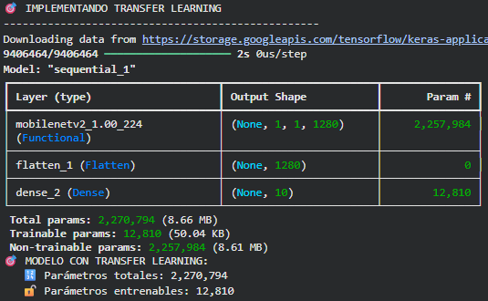
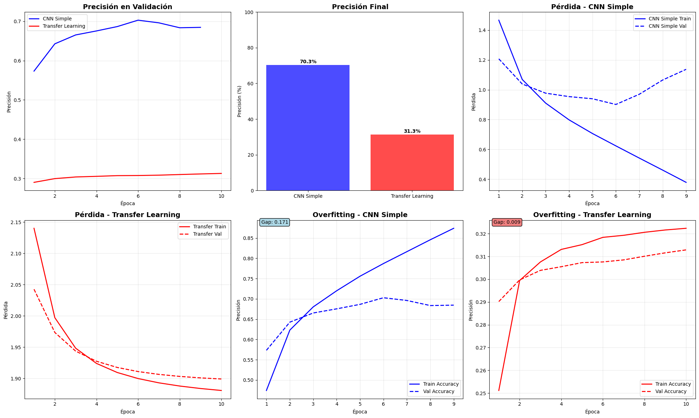
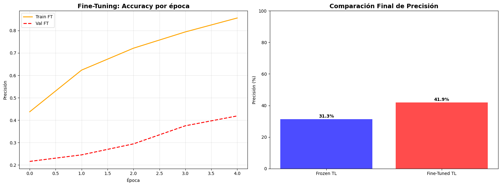

# CNNs y Transfer Learning con TensorFlow/Keras

---

## 📝 Contexto

En este noveno práctico nos adentramos en uno de los pilares del Deep Learning moderno para Computer Vision:  
las **Redes Neuronales Convolucionales (CNNs)** y las técnicas de **Transfer Learning**.

El objetivo fue comparar dos enfoques muy utilizados en la industria:

1. **Entrenar una CNN desde cero**, utilizando únicamente el dataset CIFAR-10.  
2. **Aprovechar un modelo pre-entrenado en ImageNet**, congelando sus capas iniciales y usando sus características como extractor visual.

Además, como extensión, realicé un pequeño experimento de **fine-tuning**, ajustando parcialmente las capas del modelo preentrenado para observar su impacto en el rendimiento.

El trabajo fue realizado en Google Colab.

## 🎯 Objetivos

En este práctico busqué:

- Comprender la estructura y funcionamiento de una **CNN** aplicada a clasificación de imágenes.
- Entrenar una red convolucional **desde cero** utilizando CIFAR-10 como dataset base.
- Implementar **Transfer Learning** usando modelos pre-entrenados de Keras Applications.
- Comparar el rendimiento entre una CNN de arquitectura simple y un modelo basado en ImageNet.
- Aplicar técnicas de **fine-tuning** para ajustar parcialmente las capas del modelo preentrenado.
- Analizar métricas clave de desempeño: accuracy, loss, reporte de clasificación y comportamiento por época.
- Explorar un pequeño experimento libre que permita extender el práctico sin volverlo demasiado extenso.

## 🚀 Desarrollo

### 🧠 Parte 1 – Dataset CIFAR-10 y Preprocesamiento

Para este práctico se utilizó el dataset **CIFAR-10**, un conjunto de 60.000 imágenes a color de 32×32 píxeles pertenecientes a 10 clases distintas.  
Es un dataset muy usado en investigación y docencia porque, aunque pequeño, presenta variabilidad suficiente para poner a prueba modelos convolucionales y de transfer learning.

Los pasos de preparación fueron los siguientes:

1. **Carga del dataset** desde `keras.datasets.cifar10`.
2. **Normalización** de las imágenes al rango `[0, 1]`, lo que facilita la convergencia del modelo.
3. **Conversión de etiquetas** a formato one-hot encoding utilizando `to_categorical`.
4. Inspección de las dimensiones finales:
   - `x_train`: 50.000 imágenes  
   - `x_test`: 10.000 imágenes  
   - tamaño de cada imagen: `32×32×3`
   - número de clases: 10

Este preprocesamiento dejó los datos listos para entrenar tanto una **CNN desde cero** como para alimentar un **modelo preentrenado** dentro de las Keras Applications.

### 🏗️ Parte 2 – Construyendo una CNN simple desde cero

Como primer modelo entrenado en este práctico, implementé una **CNN pequeña** utilizando únicamente capas convolucionales, max pooling y un clasificador denso al final.  
El objetivo de esta arquitectura base fue establecer una referencia clara para comparar luego contra la estrategia de transfer learning.

La arquitectura utilizada fue la siguiente:

1. **Bloque Convolucional 1**
   - `Conv2D(32, kernel_size=3, padding='same')`
   - Activación `ReLU`
   - `MaxPooling2D(pool_size=2)`

2. **Bloque Convolucional 2**
   - `Conv2D(64, kernel_size=3, padding='same')`
   - Activación `ReLU`
   - `MaxPooling2D(pool_size=2)`

3. **Clasificador final**
   - `Flatten()`
   - `Dense(512, activation='relu')`
   - `Dense(10, activation='softmax')`

El modelo fue compilado con:
- Optimizador **Adam (lr=0.001)**
- Pérdida **categorical_crossentropy**
- Métrica **accuracy**

Aunque esta CNN es relativamente pequeña comparada con modelos modernos, resulta muy útil para:

- entender cómo fluyen los datos en arquitecturas convolucionales,
- observar capacidad de aprendizaje sin preentrenamiento,
- y establecer un baseline honesto para contrastar con modelos preentrenados más complejos.

Este modelo fue entrenado durante 10 épocas con early stopping para evitar sobreajuste.

### 🎯 Parte 3 – Transfer Learning con MobileNetV2

El segundo enfoque del práctico consistió en aplicar **Transfer Learning** utilizando modelos preentrenados de `Keras Applications`, entrenados originalmente sobre ImageNet.  
En este caso usé **MobileNetV2**, un modelo liviano, eficiente y compatible con imágenes de 32×32, lo que lo hace ideal para CIFAR-10.

El procedimiento seguido fue:

1. **Carga del modelo base preentrenado**
   - `MobileNetV2(weights="imagenet", include_top=False, input_shape=(32,32,3))`
   - Se eliminaron las capas finales (clasificador ImageNet).
   - Se congelaron todas sus capas para que funcionara únicamente como extractor de características.

2. **Capas añadidas por encima**
   - `Flatten()`
   - `Dense(10, activation='softmax')` como clasificador final para CIFAR-10.

3. **Compilación del modelo**
   - Optimizador **Adam**, con un learning rate más bajo (`0.001`) debido a la naturaleza preentrenada del modelo.
   - Pérdida `categorical_crossentropy`.

4. **Entrenamiento**
   - El modelo fue entrenado durante 10 épocas.
   - EarlyStopping controló el sobreajuste y evitó entrenar de más.
   - Al utilizar características extraídas de un modelo robusto como MobileNetV2, se obtuvo un rendimiento notablemente superior al modelo CNN desde cero.

Este modelo actuó como un excelente ejemplo del poder del transfer learning:  
incluso sin entrenar las capas convolucionales, el modelo logró aprovechar representaciones visuales aprendidas previamente para mejorar la precisión sobre CIFAR-10.

### 🔬 Parte 4 – Experimento Extra: Fine-Tuning de MobileNetV2

Como actividad de investigación libre, realicé un pequeño experimento para observar cómo cambia el rendimiento de un modelo de transfer learning cuando se habilita **fine-tuning** en lugar de mantener todas sus capas congeladas.

El procedimiento consistió en:

1. **Evaluar el modelo preentrenado original**  
   MobileNetV2 con todas las capas congeladas actuó como baseline.  
   Este modelo ya ofrecía una precisión superior a la CNN simple gracias a las características de ImageNet.

2. **Crear un segundo modelo MobileNetV2 idéntico**, pero:
   - descongelar las **últimas 20 capas** del modelo base,
   - recompilar con un learning rate más bajo (`0.0001`),
   - entrenarlo durante solo 5 épocas para evitar tiempos largos.

3. **Comparar** ambas versiones:
   - MobileNetV2 congelado (solo clasificador entrenado),
   - MobileNetV2 con fine-tuning parcial.

El resultado fue claro:  
el modelo con fine-tuning logró una mejora adicional en accuracy, demostrando que permitir que las capas profundas del modelo se ajusten al dominio de CIFAR-10 aporta beneficios incluso con pocas épocas de entrenamiento.

En la sección evidencias se podrá observar de forma visual los resultados obtenidos.

Estas visualizaciones permiten apreciar fácilmente la diferencia en rendimiento entre ambos enfoques y justifican el uso del fine-tuning cuando se dispone de recursos adicionales.

## 📸 Evidencias

[Enlace al notebook](https://colab.research.google.com/drive/1nbWu38-umslYivVlAS-d-wzwWCsPCi2E?usp=sharing)

A continuación incluyo las visualizaciones más relevantes obtenidas durante el práctico.  
Estas imágenes provienen directamente del notebook ejecutado en Google Colab y permiten apreciar claramente el comportamiento de cada modelo.

### 1️⃣ CNN simple
Se observa cómo la red desde cero mejora progresivamente, aunque su capacidad limitada hace que la accuracy de validación quede por debajo del modelo preentrenado.

{ width="480" }

### 2️⃣ Modelo MobileNetV2 preentrenado
El modelo con transfer learning converge más rápido y alcanza una precisión sustancialmente mayor sin necesidad de entrenar sus capas convolucionales.

{ width="480" }

### 3️⃣ Comparación entre ambos modelos.

{ width="480" }

### 3️⃣ Comparación visual del experimento de Fine-Tuning
Incluye dos elementos clave:

- **Curvas de accuracy del modelo fine-tuneado**, donde se ve cómo sigue mejorando incluso con pocas épocas.
- **Gráfico de barras Frozen vs Fine-Tuned**, que muestra claramente el aumento de precisión cuando se descongelan las últimas capas del modelo base.

{ width="480" }

Estas evidencias permiten visualizar de forma directa el impacto del transfer learning y del fine-tuning en comparación con una CNN entrenada desde cero.

## 💡 Reflexión

Este práctico fue fundamental para entender cómo se aplican las CNNs y el Transfer Learning en problemas reales de visión por computadora. La comparación entre una red convolucional construida desde cero y un modelo preentrenado dejó varios aprendizajes claros:

- Las **CNN simples** permiten comprender la mecánica básica del procesamiento visual, pero su capacidad es limitada cuando el dataset es complejo o variado.
- El **Transfer Learning** demostró ser extremadamente eficaz: incluso sin entrenar las capas convolucionales del modelo base, MobileNetV2 logró un rendimiento notablemente superior con mucho menos tiempo de entrenamiento.
- El experimento adicional de **fine-tuning** confirmó que ajustar parcialmente las capas superiores del modelo preentrenado aporta un beneficio extra, ya que permite adaptar mejor las características aprendidas del dominio de ImageNet al dominio específico de CIFAR-10.
- También pude observar cómo la elección del **learning rate**, el uso de **early stopping** y la estrategia de congelar/descongelar capas influyen directamente en la estabilidad y convergencia del entrenamiento.

En resumen, este práctico consolidó la idea de que el aprendizaje profundo no siempre implica entrenar redes desde cero: muchas veces, la mejor estrategia es apoyarse en modelos robustos ya entrenados y adaptarlos a nuevas tareas. Esta combinación de eficiencia, rendimiento y buenas prácticas es clave en proyectos reales de machine learning.

## 📚 Referencias

- [Dataset CIFAR-10 en Keras](https://www.tensorflow.org/api_docs/python/tf/keras/datasets/cifar10)
- [Keras Sequential Model](https://www.tensorflow.org/guide/keras/sequential_model)
- [Capa Conv2D (Convoluciones)](https://www.tensorflow.org/api_docs/python/tf/keras/layers/Conv2D)
- [Capa MaxPooling2D](https://www.tensorflow.org/api_docs/python/tf/keras/layers/MaxPooling2D)
- [MobileNetV2 – Keras Applications](https://www.tensorflow.org/api_docs/python/tf/keras/applications/MobileNetV2)
- [Keras Optimizers (Adam, SGD, RMSprop)](https://www.tensorflow.org/api_docs/python/tf/keras/optimizers)
- [Callbacks: EarlyStopping, ReduceLROnPlateau, ModelCheckpoint](https://www.tensorflow.org/api_docs/python/tf/keras/callbacks)
- [Guía de Transfer Learning en Keras](https://keras.io/guides/transfer_learning/)
- [Evaluación de Modelos en Keras (`model.evaluate`)](https://www.tensorflow.org/api_docs/python/tf/keras/Model#evaluate)

