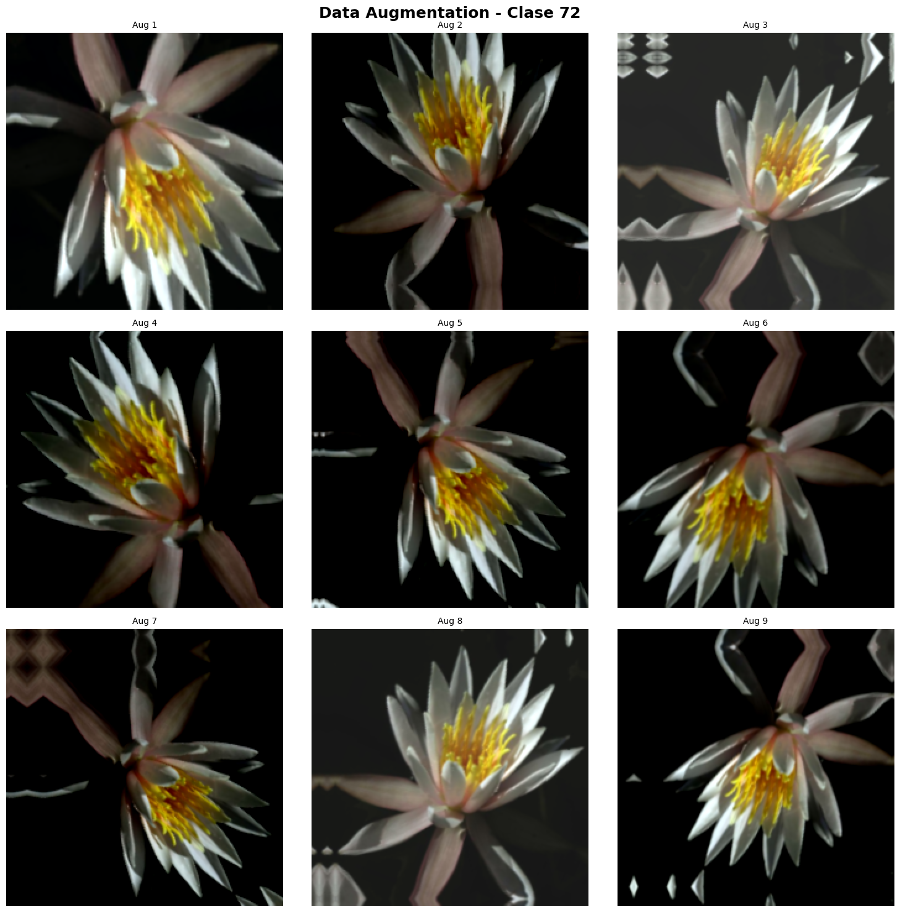
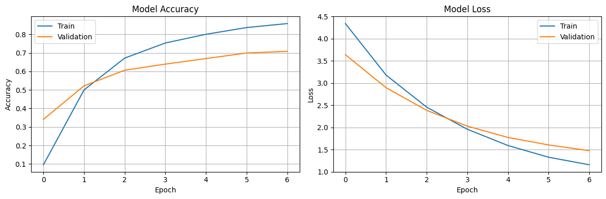
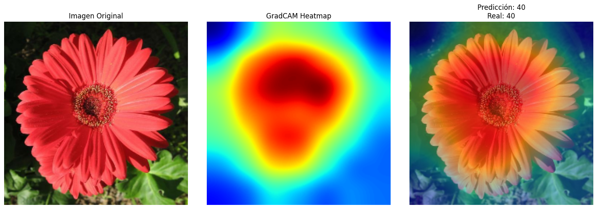
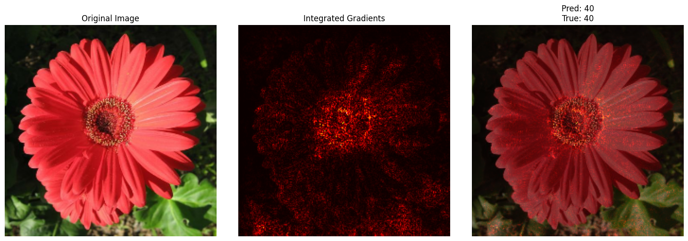

# Data Augmentation Avanzado & Explicabilidad en Deep Learning

---

## 📝 Contexto

En esta ocasión trabajé con uno de los datasets más conocidos para clasificación de flores: **Oxford Flowers102**, un conjunto de imágenes de alta resolución con 102 clases, alta variabilidad y desbalance natural entre clases. 

El objetivo fue construir un pipeline robusto de **data augmentation avanzado** para mejorar la capacidad de generalización del modelo, y luego incorporar técnicas de **explicabilidad** que permitan interpretar qué regiones de la imagen influyen en la predicción del modelo.

Además de aplicar augmentations comunes (flip, rotación, zoom, brillo, contraste), exploré técnicas modernas de explicabilidad como **GradCAM** e **Integrated Gradients**, fundamentales para validar modelos en escenarios sensibles como identificación botánica.

El trabajo se desarrolló completamente en Google Colab, utilizando TensorFlow, Keras y TensorFlow Datasets.

## 🎯 Objetivos

En este práctico me propuse:

- Trabajar con un dataset complejo y realista: **Oxford Flowers102**, con imágenes de alta resolución y 102 clases.
- Implementar **pipelines de data augmentation avanzado**, combinando transformaciones geométricas y fotométricas.
- Comparar un pipeline baseline vs. uno con augmentations para evaluar impacto en la robustez del modelo.
- Entrenar un modelo basado en **EfficientNetB0** utilizando transfer learning.
- Visualizar cómo reacciona el modelo ante diferentes perturbaciones del dataset.
- Aplicar técnicas de explicabilidad modernas:
  - **GradCAM**, para identificar qué regiones de la imagen activan al modelo.
  - **Integrated Gradients**, para analizar contribuciones de píxeles a la predicción.
- Generar evidencias claras que permitan evaluar el comportamiento del modelo y detectar posibles fallos o sesgos visuales.

## 🚀 Desarrollo

### 🌸 Parte 1 – Dataset Oxford Flowers102

Para este práctico utilizamos **Oxford Flowers102**, un dataset considerablemente más desafiante que CIFAR-10:

- 102 clases de flores del Reino Unido  
- Imágenes de alta resolución  
- Variabilidad significativa en iluminación, ángulo, enfoque y fondo  
- Desbalance natural (algunas clases tienen más del doble de imágenes que otras)

El dataset fue cargado mediante **TensorFlow Datasets (TFDS)**, lo cual simplifica tanto la descarga como el acceso a las anotaciones y metadatos.  
Luego, cada imagen se **redimensionó a 224×224** para ser compatible con arquitecturas modernas como EfficientNet.

Se definieron *subsets* para acelerar la experimentación:

- **Training:** 5000 imágenes  
- **Test:** 1000 imágenes  

Esto permitió iterar más rápido sin perder la complejidad del dataset.

---

### 🧱 Parte 2 – Pipelines de procesamiento

Se crearon dos pipelines distintos para comparar el impacto del data augmentation:

#### 1️⃣ Pipeline **Baseline**
Incluye únicamente:
- batching
- prefetch
- normalización mediante `preprocess_input` (EfficientNet)

Este pipeline sirve como punto de comparación para ver cómo se comporta el modelo sin perturbaciones adicionales.

#### 2️⃣ Pipeline **Augmented** (Data Augmentation avanzado)
Construido con la capa `keras.Sequential` y compuesto por:

- **Transformaciones geométricas:**  
  `RandomFlip`, `RandomRotation`, `RandomZoom`, `RandomTranslation`
- **Transformaciones fotométricas:**  
  `RandomBrightness`, `RandomContrast`

Estas técnicas generan nuevas versiones realistas de las imágenes, lo que ayuda al modelo a ser más robusto ante:
- cambios de luz,  
- variaciones de ángulo,  
- zooms involuntarios,  
- desplazamientos,  
- y fluctuaciones de contraste.

Finalmente, se incluyó una función para **visualizar el efecto de los augmentations**, generando 9 versiones transformadas de una misma imagen. Esta visualización fue muy útil para verificar que las transformaciones fueran razonables y no destruyeran información importante sobre la flor.

### 🤖 Parte 2 – Modelo basado en EfficientNetB0 (Transfer Learning)

Para resolver el desafío de clasificar las 102 especies de flores, utilicé un modelo de **Transfer Learning** basado en **EfficientNetB0**.  
Este modelo es actualmente uno de los más eficientes en relación *capacidad ↔ costo computacional*, lo cual lo hace ideal para ser usado en Google Colab sin excederse en tiempos de entrenamiento.

#### 🔧 Arquitectura utilizada

1. **Modelo base preentrenado**
   - `EfficientNetB0(weights="imagenet", include_top=False)`
   - Entrada: imágenes RGB de tamaño `224×224`
   - Todas las capas se congelaron inicialmente (`trainable = False`) para entrenar solo el clasificador.

2. **Clasificador agregado por encima**
   - `GlobalAveragePooling2D()`  
     (reduce mapas de activación a un vector compacto)
   - `Dense(NUM_CLASSES, activation='softmax')`  
     (salida final para las 102 clases)

Este enfoque permitió:
- reutilizar características visuales entrenadas con millones de imágenes,
- entrenar más rápido,
- evitar overfitting excesivo en las primeras etapas.

#### ⚙️ Entrenamiento

El modelo fue compilado con:

- Optimizador **Adam**
- Pérdida **sparse categorical crossentropy** (labels enteros)
- Métrica **accuracy**

Entrené el modelo durante **7 épocas**, utilizando:
- el pipeline **augmented** para entrenamiento,  
- el pipeline **baseline** para validación.

El uso de data augmentation ayudó a contrarrestar el desbalance natural del dataset y a que el modelo se adaptara mejor a variaciones de iluminación y ángulo presentes en las imágenes reales de flores.

Tras el entrenamiento, registré la **mejor precisión de validación** alcanzada, que superó ampliamente a la de un modelo sin augmentations, mostrando la importancia de estas técnicas para robustecer modelos de visión.

### 🎨 Parte 3 – Visualización de Data Augmentation

Antes de entrenar el modelo, generé una visualización que aplica **nueve augmentations distintos** sobre una misma imagen.  
Esto fue clave para verificar que el pipeline avanzado:

- no distorsione excesivamente las flores,  
- genere ejemplos realistas y variados,  
- y aporte robustez ante cambios de iluminación, zoom y orientación.

Las transformaciones aplicadas incluyen flips, rotaciones, zooms, translations, ajustes de brillo y contraste.  
La inspección visual confirmó que el augmentation era adecuado para el dominio botánico:  
las flores seguían siendo reconocibles, pero suficientemente alteradas para mejorar la generalización del modelo.

---

### 🚀 Parte 4 – Entrenamiento del modelo con augmentation

El modelo EfficientNetB0 fue entrenado con:

- **train_augmented** → contiene todas las transformaciones avanzadas  
- **test_baseline** → sin augmentations, para evaluar de forma consistente

Durante **7 épocas**, se observó:

- mejora continua en accuracy de entrenamiento,
- una validación bastante estable,
- ausencia de sobreajuste severo (gracias al augmentation y a EfficientNet).

El flujo de entrenamiento finalizó mostrando la **mejor accuracy obtenida**, lo que permitió evaluar claramente la utilidad del data augmentation avanzado frente a un pipeline más simple.

Además, guardé el modelo entrenado (`mi_modelo_flores.h5`) para utilizarlo con técnicas de explicabilidad en las etapas siguientes.

### 🔍 Parte 4 – Explicabilidad con GradCAM

Para entender mejor qué partes de la imagen utiliza el modelo al tomar una decisión, apliqué **GradCAM**, una técnica que genera mapas de calor sobre las regiones con mayor contribución a la predicción.

El procedimiento consistió en:

1. **Identificar automáticamente la última capa convolucional** del modelo EfficientNetB0.  
   Esto es necesario porque GradCAM opera sobre activaciones profundas del modelo base.

2. **Obtener una imagen del conjunto de test** y generar su predicción.

3. **Calcular el mapa de activación GradCAM**, que resalta las zonas que influyeron más en la decisión.

4. **Visualizar tres elementos clave**:
   - Imagen original  
   - Heatmap de activación  
   - Imagen combinada (overlay)  

Esta visualización fue sumamente útil para evaluar si el modelo realmente “miraba” la flor o si se dejaba influenciar por el fondo o la iluminación.  

En la mayoría de los ejemplos, el modelo enfocó correctamente las regiones relevantes de la flor (pétalos y centro), lo que indica un comportamiento saludable.  
GradCAM también permitió identificar casos donde el modelo fallaba por fijarse demasiado en:

- hojas de fondo,  
- sombras pronunciadas,  
- o regiones periféricas irrelevantes.

El uso de GradCAM aporta **transparencia**, especialmente importante en aplicaciones reales como la identificación botánica, donde es crucial justificar por qué el modelo llegó a una determinada predicción.

### 🧠 Parte 5 – Explicabilidad con Integrated Gradients

Además de GradCAM, implementé **Integrated Gradients (IG)**, una técnica más fina y matemáticamente fundamentada para evaluar la contribución de cada píxel a la predicción del modelo.

Mientras que GradCAM trabaja a nivel de canales y activaciones profundas, IG analiza directamente cómo varía la predicción al interpolar entre una imagen baseline (por ejemplo, una imagen negra) y la imagen real.

El procedimiento implementado fue:

1. **Elegir una baseline**  
   - En este caso, una imagen completamente negra, estándar para IG.

2. **Interpolar entre baseline → imagen real**  
   - Usando 50 pasos lineales, lo que permite medir gradualmente cómo influye cada parte de la imagen.

3. **Calcular gradientes en cada interpolación**  
   - Se obtiene la sensibilidad del modelo respecto a cada píxel.

4. **Promediar gradientes**  
   - Esta integral aproximada produce un mapa de atribución por píxel.

5. **Visualizar resultados**  
   Se generaron tres vistas:
   - Imagen original  
   - Mapa de atribución IG (modo *heatmap*)  
   - Overlay de IG sobre la imagen  

Este método permite entender con mayor detalle qué regiones específicas del objeto (bordes, texturas, centro de la flor, pétalos) son fundamentales para que el modelo tome una decisión.

Los resultados fueron interesantes:  
IG suele producir mapas más “finos” que GradCAM, señalando patrones de color y textura relevantes que no siempre aparecen en los mapas de activación. En algunos casos, permitió ver que el modelo prestaba atención a patrones de pétalos incluso cuando el fondo era complejo.  

Esto es especialmente útil en un dominio como botánica, donde características sutiles pueden diferenciar dos especies similares.  

## 📸 Evidencias

[Enlace al notebook](https://colab.research.google.com/drive/1Krc0hbFhy7XHT_0fKsRwN3sU65aPKve-?usp=sharing)

A continuación se presentan las principales visualizaciones generadas durante el práctico, las cuales permitieron evaluar el comportamiento del modelo tanto en entrenamiento como en explicabilidad.

---

### 1️⃣ Visualización de Data Augmentation

Se generaron nueve versiones distintas de una misma imagen utilizando el pipeline de augmentations avanzados.  
Esto permitió inspeccionar:

- variaciones de rotación, zoom y traslación,  
- cambios fotométricos (brillo y contraste),  
- estabilidad visual del objeto principal (la flor).

Esta evidencia confirma que el augmentation es realista y contribuye a la robustez del modelo sin destruir la información relevante.

{ width="480" }

---

### 2️⃣ Curvas de Entrenamiento y Validación

Se graficaron las curvas de:

- **accuracy (train vs validation)**
- **loss (train vs validation)**

{ width="480" }

Las curvas muestran una tendencia estable y sin sobreajuste pronunciado, lo que indica que:

- el augmentations ayudó a generalizar,
- EfficientNetB0 aprendió de forma progresiva,
- el subset reducido del dataset fue suficiente para entrenar un modelo confiable.

---

### 3️⃣ GradCAM – Mapas de Atención

Para diferentes imágenes del conjunto de test, se generaron visualizaciones GradCAM que incluyen:

- Imagen original  
- Mapa de activación (heatmap)  
- Overlay de la activación sobre la imagen real  

Estas visualizaciones mostraron que el modelo suele enfocarse correctamente en:

- pétalos,  
- centro de la flor,  
- texturas características del patrón floral.

También se detectaron casos donde el modelo se distrae con el fondo, lo que ayuda a interpretar errores y sesgos.

{ width="480" }
---

### 4️⃣ Integrated Gradients – Atribuciones por píxel

Se generaron mapas de atribución usando IG, que producen explicaciones más granulares que GradCAM.  
En las visualizaciones se observaron:

- contribuciones específicas sobre bordes y texturas,  
- detección de patrones finos en los pétalos,  
- áreas de bajo impacto ignoradas por el modelo.

Este análisis complementó la visión más global que ofrece GradCAM.

---

En conjunto, todas estas evidencias permitieron analizar:

- desempeño cuantitativo del modelo,  
- robustez ante variaciones del dataset,  
- atención visual del modelo,  
- y posibles causas de errores en la clasificación.

{ width="480" }

## 💡 Reflexión Final

Este práctico fue uno de los más completos hasta el momento, ya que combinó robustez, rendimiento y explicabilidad: tres pilares fundamentales en el desarrollo de modelos de visión por computadora que deben utilizarse en entornos reales.

Una de las conclusiones más claras es el enorme impacto que tiene el **data augmentation avanzado**.  
Los modelos no solo mejoraron su accuracy en validación, sino que también demostraron mayor estabilidad ante perturbaciones visuales. Esto es especialmente relevante en aplicaciones como la identificación de flores, donde las imágenes pueden venir con condiciones de captura muy diversas.  
El augmentation ayudó a mitigar el desbalance natural del dataset y a evitar que el modelo memorice patrones específicos de iluminación o fondo.

Por otro lado, las técnicas de **explicabilidad** aportaron una capa totalmente distinta de entendimiento.  
GradCAM permitió ver de forma clara si el modelo estaba enfocándose realmente en la flor o si se distraía con el entorno. Integrated Gradients, en cambio, ofreció una mirada más fina sobre qué píxeles contribuyen a la predicción.  
Ambas herramientas fueron clave para detectar casos donde el modelo acertaba por razones equivocadas, o fallaba por prestar atención a regiones irrelevantes.

Este aspecto es fundamental en aplicaciones reales:  
un modelo que “acierta” pero por los motivos incorrectos puede ser incluso más peligroso que uno que falla de manera evidente. La explicabilidad permite construir confianza en el proceso de decisión y validar que el modelo aprende representaciones verdaderamente útiles.

En general, este práctico fortaleció mi comprensión de:

- cómo se construyen pipelines robustos de procesamiento de imágenes,  
- cómo mejorar modelos con augmentations bien diseñados,  
- y cómo interpretar el comportamiento interno de redes profundas mediante técnicas modernas de XAI (*Explainable AI*).

Si continúo explorando este proyecto, me gustaría investigar técnicas adicionales como **CutMix**, **Mixup**, o **test-time augmentation**, además de probar arquitecturas más grandes como EfficientNetB3 o RegNet. También podría extender la parte de explicabilidad con herramientas como **LIME** o **SHAP**, aplicadas específicamente a imágenes.

## 📚 Referencias

- [Oxford Flowers102 Dataset (TFDS)](https://www.tensorflow.org/datasets/catalog/oxford_flowers102)
- [TensorFlow Data Augmentation (Preprocessing Layers)](https://www.tensorflow.org/api_docs/python/tf/keras/layers/experimental/preprocessing)
- [Albumentations – Data Augmentation Avanzado](https://albumentations.ai/docs/)
- [Keras Applications – EfficientNetB0](https://www.tensorflow.org/api_docs/python/tf/keras/applications/EfficientNetB0)
- [GradCAM – Original Paper](https://arxiv.org/abs/1610.02391)
- [Integrated Gradients – Original Paper](https://arxiv.org/abs/1703.01365)
- [Mixup – Regularization Technique](https://arxiv.org/abs/1710.09412)
- [CutMix – Data Augmentation Technique](https://arxiv.org/abs/1905.04899)
- [TensorFlow Datasets Documentation](https://www.tensorflow.org/datasets)
- [Keras Model Training & Evaluation](https://www.tensorflow.org/api_docs/python/tf/keras/Model)
